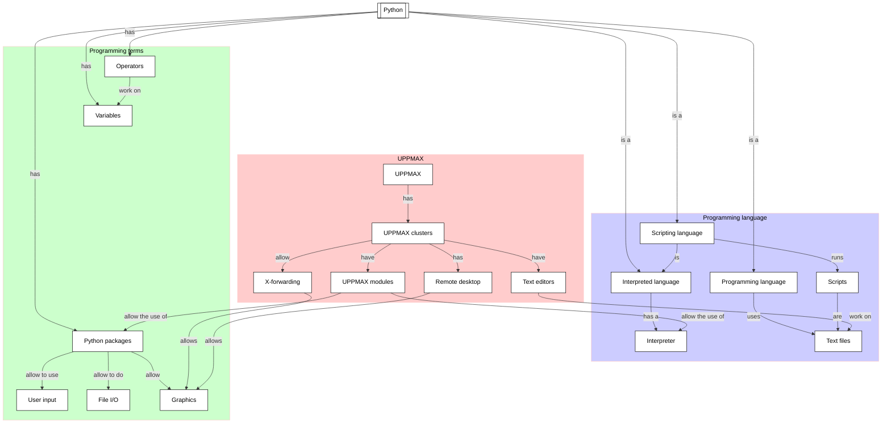

# Files

!!!- info "Learning objectives"

    - Have read a file
    - Have created a file

???- question "For teachers"

    Teaching goals are:

    * Learners have read a file
    * Learners have created a file

    Lesson plan:

    * 5 mins: prior knowledge
    * 5 mins: presentation
    * 15 mins: challenge
    * 5 mins: feedback

## Overview

Most programmers need to work on data and produce some result.
In Python, we -of course- can read from files and write to files.
Here we do just that.

## Exercises

See the exercise procedure [here](../misc/exercise_procedure.md).

### Exercise 1: create a simple text file

!!!- info "Learning objectives"

    - Create a simple text file

Read the following sections of [How to Think Like a Computer Scientist: Learning with Python 3](https://openbookproject.net/thinkcs/python/english3e/index.html):

- 13.1. About files
- 13.2. Writing our first file

Then do:

- Put the code at the top of 13.2 in a Python script
- Run that code
- Verify that it works as expected

### Exercise 2: read and create a simple text file

!!!- info "Learning objectives"

    - Read a simple text file
    - Repeat creating a file
    - Practice to search the internet how to reverse the order of text lines

Read the following sections of [How to Think Like a Computer Scientist: Learning with Python 3](https://openbookproject.net/thinkcs/python/english3e/index.html):

- 13.4. Turning a file into a list of lines

Consider searching for ['Python reverse order'](https://lmddgtfy.net/?q=python%20reverse%20order),
as you will need to do this in the exercise.

Then do:

- Exercise 13.11.1

## Links

- [How to Think Like a Computer Scientist: Learning with Python 3](https://openbookproject.net/thinkcs/python/english3e/index.html)
