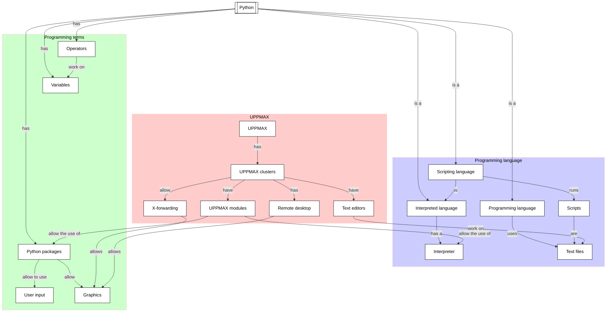

# Hello, little turtles! 

!!!- info "Learning objectives"

    - Have a first 'Get stuff to work' experience
    - Rehearse creating a script
    - Experience when importing a Python package gives an error
    - Search for an UPPMAX module that needs to be loaded
    - Import a Python package successfully

???- question "For teachers"

    Teaching goals are:

    - Learners have observed the error when importing a Python package without the needed UPPMAX module loaded
    - Learners have search through the UPPMAX modules
    - Learners may find out that X-forwarding is important
    - Learners have gotten 'stuff to work'

    Other goals are:

    - Verify that learners indeed have learned how to login with X-forwarding.
      Redirect to remote desktop environment as a solution

    Lesson plan:

    - 5 mins: prior knowledge
    - 5 mins: presentation
    - 25 mins: challenge
    - 5 mins: feedback

## Overview

Sometime you need to get 'stuff to work', for example,
code written by someone else. 
In this session, we practice this, 
going through the problems and errors that occur 
when you want to 'just want to run the stupid code'.

## Exercises

### Exercise 1: Fail at running a first program

!!!- info "Learning objectives"

    - Rehearse creating a script
    - Try to import a Python package
    - Observe errors when a package is absent

Read the following sections of [How to Think Like a Computer Scientist: Learning with Python 3](https://openbookproject.net/thinkcs/python/english3e/index.html):

 * 3.1. Our first turtle program

Copy-paste the first script in that section to a script.

Run the script and verify it will not run. Does the error message make sense?

### Exercise 2: Running a first program

!!!- info "Learning objectives"

    - Import a Python package
    - Practice to search for an UPPMAX module that needs to be loaded
    - Get a script that requires an UPPMAX module to be loaded to work

Now we try to make this script work!

Read: 

- [the UPPMAX documentation 'Loading Python packages'](http://docs.uppmax.uu.se/software/python/#loading-python-packages)
- [the UPPMAX documentation 'Modules'](http://docs.uppmax.uu.se/cluster_guides/modules/)

Now, try to get the script to work. 

When running the code, there should be a visible pop-up window. If not, 
re-read [the UPPMAX documentation page 'Login to Rackham'](http://docs.uppmax.uu.se/getting_started/login_rackham/)
and enable X-forwarding. If X-forwarding does not work, 
use the Rackham remote desktop environment.

???- question "Need more hints?"

    The exercise is about *practicing* to search for an UPPMAX module,
    hence giving away the answer makes this session useless.

    However, if you feel stuck too much, 
    you can watch a video in which this exercise is done
    [here](https://youtu.be/bnN-1uzsgvk)

## Links

 * [How to Think Like a Computer Scientist: Learning with Python 3](https://openbookproject.net/thinkcs/python/english3e/index.html)
