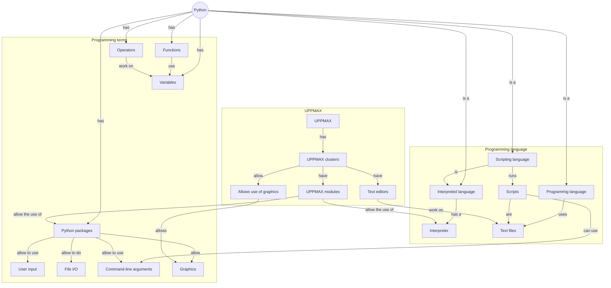

# Overview

This module introduces the fundamentals of Python programming language. 

!!! info "Content"
    * The course emphasises hands-on experience with Python in the UPPMAX
      environment. It focuses on the basics and can be taken by someone *without*
      any prior Python experience.
    * **You will learn:**
        * :heavy_check_mark: How to load and use different version of Python on our clusters
        * :heavy_check_mark: How to work with basic builtin data types
        * :heavy_check_mark: How to create and run a Python script
        * How to use UPPMAX modules to load a Python package
        * How to reading files
        * How to writing to files
        * How to creating a command line program that can take input arguments
        * How to use control flow statements
        * How to draw a plot (i.e. an x-y line plot)
        * How to bundle code into reusable functions

??? info "For teachers"

    Classic-style lecture and exercises can be found at [lecture.md](lecture.md)
    and [exercise.md](exercise.md)
    
## Schedule

| Time          | Topic                         | 
|---------------|-------------------------------|
| 13:00-14:00   | [UPPMAX modules and Python packages](hello_little_turtles.md)
| 14:00-14:15   | Break                         |
| 14:15-15:00   | [File IO](files.md), [command line arguments](command_line_arguments.md) |
| 15:00-15:15   | Break                         |
| 15:15-16:00   | [Graphics](graphics.md), [functions](functions.md)            | 

- Extra materials: 
  - Conditionals (['How to Think Like a Computer Scientist'](https://openbookproject.net/thinkcs/python/english3e/index.html) chapter 5)
  - Fruitful functions (['How to Think Like a Computer Scientist'](https://openbookproject.net/thinkcs/python/english3e/index.html) chapter 6)
  - Other Python programming environments: IPython, Jupyter, VSCode

Link to HackMd: <https://hackmd.io/@dianai/uppmax-intro/>

## Overview

## Links

 * [YouTube video on `python` versus `IPython`](https://youtu.be/lhi7s6RoIys?si=Z72gSIb6q3piucPH)
 * [YouTube video on `IPython`](https://www.youtube.com/watch?v=S9rgGJYAQ8o)
 * [Free online book: 'How to Think Like a Computer Scientist'](https://openbookproject.net/thinkcs/python/english3e/index.html)
