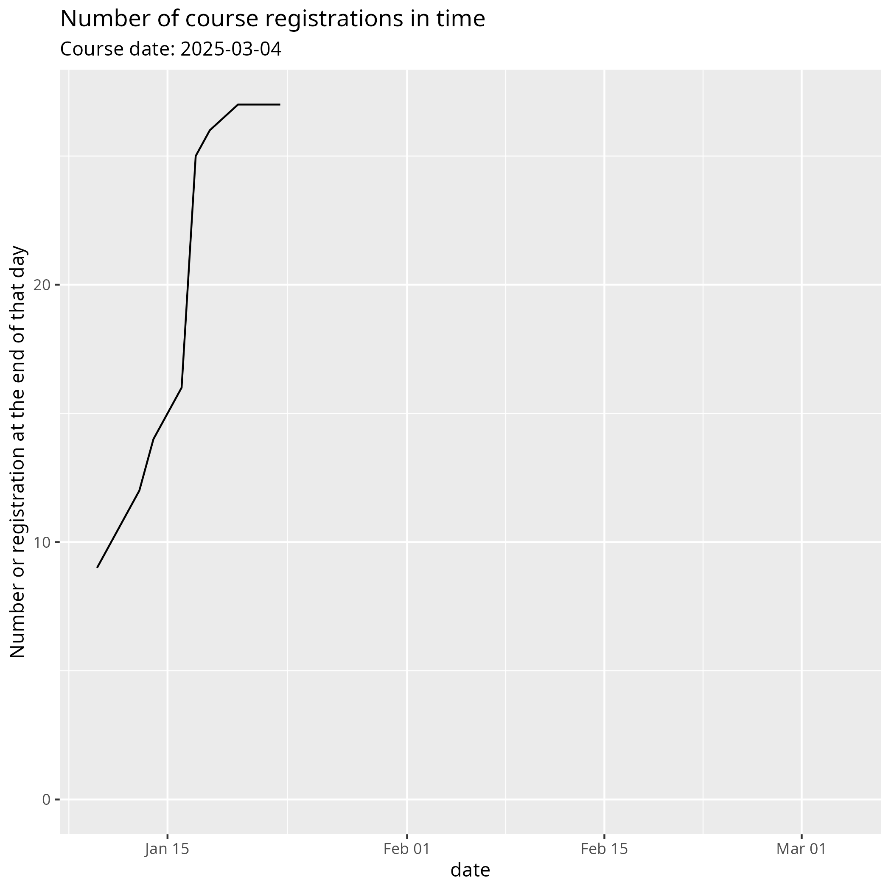

# 2025-03-04

## Registrations

As a learner, it can be assuring to know you have registered.
Here are the registrations we've received,
with an MD5 of the email address.

- Data: [registrations.csv](registrations.csv)
    - `timestamp`: the timestamp in `DD/MM/YYYY hh:mm:ss`
      format
    - `email`: the MD5 hash of the email address

## Number of registrations in time

- Data: [n_registrations_in_time.csv](n_registrations_in_time.csv)
- Code: [plot_n_registrations_in_time.R](plot_n_registrations_in_time.R)
    - `date`: the date, in `DD/MM/YYYY` format
    - `n`: the amount of registrations at that day
    - `cumulative`: the total amount of registrations
      at the end of that day

