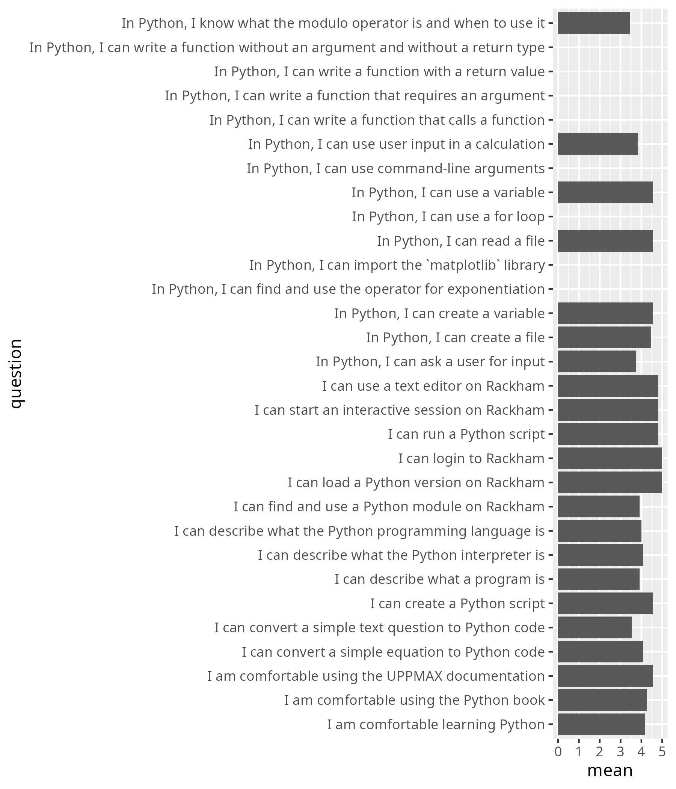

# Evaluation

- [average_confidences.csv](average_confidences.csv)
- [success_score.txt](success_score.txt): 86%

## Anonymous feedback

From [anonymous_feedback.txt](anonymous_feedback.txt):

Loved the organisation, very well prepared course! Richel is the best.

## Survey feedback

From [survey_feedback.txt](survey_feedback.txt):

- Great course. Now, Python is not scary anymore.
- Thanks for the class today! It was very well organized and I really
  appreciated your energy. I feel like maybe some things were a little basic
  for me and I wish we had gotten into the more advanced stuff at the end.
  But this really reinforced the basics for me and I'm still glad that I did it.
- Thank you for creating very interactive [class] room
- I liked Ri-kjells teaching style!

## Scores

