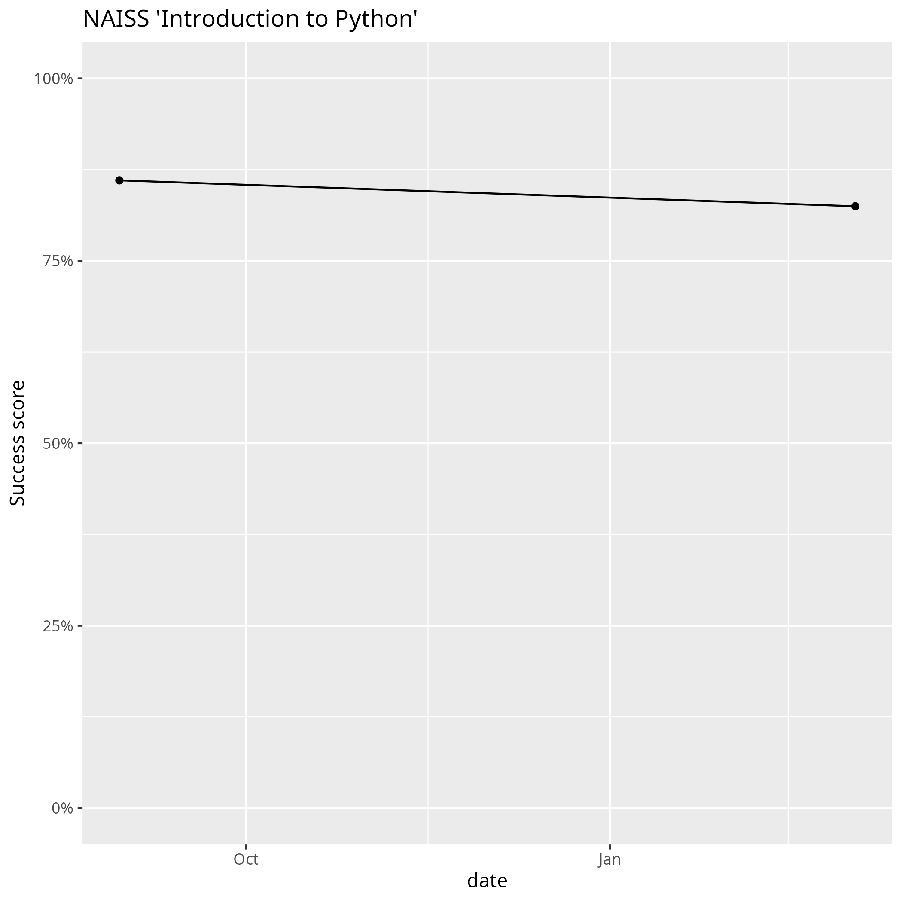

# Evaluations

???- question "Where can I evaluate this course?"

    Go to [evaluation](../evaluation.md) (singular) :-)

Here are the evaluation results of this course:

No |Date      |Evaluation                |Success score
---|----------|--------------------------|-------------
1  |2024-01-18|[here](20240118/README.md)|None measured
2  |2024-08-30|[here](20240830/README.md)|[86%](20240830/success_score.txt)
3  |2025-03-04|[here](20250304/README.md)|[82%](20250304/success_score.txt)

- The 'Success score' is the average confidence the learners
  have on each of the learning outcomes of the course

