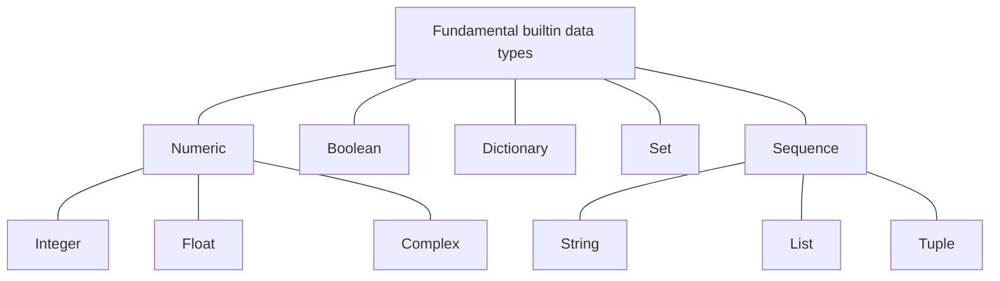

# Introduction to Python

This module introduces the fundamentals of Python programming language. The
content is adapted (and extended) from previous iterations of the course and
slides developed by Nina Fischer (see [slide deck
one](https://docs.google.com/presentation/d/1ocVm9dAFB4hJs_KVhxHapuPIOVkymltxWtVGT9nXRag/edit#slide=id.p1)
and [slide deck
two](https://docs.google.com/presentation/d/1hoFC7Ax_WsGmdl2m8aVhfVSvaHykt96lOrFqsSDEIrQ/edit#slide=id.p4)).


!!! info "Content"
    * The course emphasises hands-on experience with Python in the UPPMAX
      environment. It focuses on the basics and can be taken by someone *without*
      any prior Python experience.
    * **You will learn:**
        * How to load and use different version of Python on our clusters
        * Basic and more advanced builtin data types
        * Using control flow statements to define the logic of your Python program
        * Grouping code into reusable functions and structuring your program into
          modules
        * Creating small command line programs that can take input arguments
        * Reading and writing to files in Python
    

## Schedule

| Time  | Topic   | 
|-------------- | -------------- |
| 09:00-09:45    | Basic and Sequence data types |
| 10:00-10:15    | Break |
| 10:15-11:00    | Control flow statements  |
| 11:00-12:00    | Exercises | 
| 13:00-13:45    | Functions and Modules |
| 13:45-14:00    | Break |
| 14:15-15:00    | Command line arguments and IO |
| 15:00-16:00    | Exercises | 


## What is Python?

* Developed by Guido van Rossum in the early 1990s
* Named after the British comedy group "Monty Python",  not after the reptile
* Why Python and not Perl, Java, C++, ...?
    * Python is available for all operating systems for free
    * Python is easy to learn (not master)
    * Has a fantastic ecosystem of packages for scientific computing
    * Has a huge and great community
    * Commonly used in many scientific fields

## Getting Started

Link to HackMd: <https://hackmd.io/@dianai/uppmax-intro/>

To work with Python on UPPMAX all you need to do is login and load the desired
Python version. First login to Rackham from your terminal (or ThinLinc):

```
ssh <username>@rackham.uppmax.uu.se
```
or, to enable graphics

```
ssh <username>@rackham.uppmax.uu.se
```


In this course we will be working with version 3.10.8 of Python. To load it,
just type

``` bash
module load python/3.10.8
```

from the command line. You can use the command `module avail` to see all the
available Python version

``` 
$ module avail python

--------------------------------------------------------------------------- /sw/mf/rackham/applications ---------------------------------------------------------------------------
   python_ML_packages/3.9.5-cpu    wrf-python/1.3.1

---------------------------------------------------------------------------- /sw/mf/rackham/compilers -----------------------------------------------------------------------------
   python/2.7.6    python/2.7.11    python/3.3      python/3.4.3    python/3.6.0    python/3.7.2    python/3.9.5           python3/3.6.0    python3/3.7.2    python3/3.9.5
   python/2.7.9    python/2.7.15    python/3.3.1    python/3.5.0    python/3.6.8    python/3.8.7    python/3.10.8 (L,D)    python3/3.6.8    python3/3.8.7    python3/3.10.
8 (D)

  Where:
   L:  Module is loaded
   D:  Default Module

Use "module spider" to find all possible modules and extensions.
Use "module keyword key1 key2 ..." to search for all possible modules matching any of the "keys".


```

We can work with Python either interactively or by writing our code into files
(python modules) with the `.py` suffix.

!!! example "Interactive "Hello, world!""
    
    The canonical way of working interactively is using the Python interpreter
    which comes with the language. This is a so called REPL (read-eval-print
    loop) programming environment.
    > A read–eval–print loop (REPL), also termed an interactive toplevel or
    > language shell, is a simple interactive computer programming environment
    > that takes single user inputs, executes them, and returns the result to
    > the user; a program written in a REPL environment is executed piecewise
    > ([wiki
    > link](https://en.wikipedia.org/wiki/Read%E2%80%93eval%E2%80%93print_loop)).

    ``` bash
    # start the interpreter
    python
    ```
    This will take you to the interpreter where you can start writing Python
    code (Think of it as a calculator for code).

    ``` 
    Python 3.10.8 (main, Nov 15 2022, 21:16:40) [GCC 12.2.0] on linux
    Type "help", "copyright", "credits" or "license" for more information.
    >>> print("Hello, world!")
    Hello, world!
    >>>
    ```

    We can use Python as a calculator. Try the following

    ```
    >>> 2 + 2
    4
    >>> 50 - 5*6
    20
    >>> (50 - 5*6) / 4
    5.0
    >>> 12.45 / 100 + 7.5e-3
    0.132
    >>>
    ```

    A modern alternative is with more bells and whistles is
    [`IPython`](https://ipython.org/). This is also the backbone of the very
    popular [Jupyter Notebook](https://jupyter.org/) that you might be familiar
    with. The "Hello, world!" example is completely analogous 

    ``` bash
    # start ipython
    ipython
    ```

    And, 

    ``` ipython
    Python 3.10.8 (main, Nov 15 2022, 21:16:40) [GCC 12.2.0]
    Type 'copyright', 'credits' or 'license' for more information
    IPython 8.6.0 -- An enhanced Interactive Python. Type '?' for help.

    In [1]: print("Hello, world!")
    Hello, world!

    In [2]:
    ```

    We recommend using `IPython` for this course but you are welcome to choose
    whatever you prefer!

    * Anything that you can do in the Python interpreter you can also do in
      IPython
    * I will likely use "Python interpreter" also to refer to IPython
    * You can exit the interpreter with `exit()`, `quit()` or pressing
      `Ctrl-D`. 
    * [Tips and tricks of how to navigate IPython](
      https://ipython.readthedocs.io/en/6.5.0/config/shortcuts/index.html)


!!! example "Scripting "Hello, world!""
    The interpreter is very handy if we want to test things out or need to work
    interactively, but, often what we want is to write an executable script or
    library that can be shared, documented and reused. Let's write a hello
    world script!

    First create a file (module) called `hello_world.py` with your prefered editor

    ```
    vim hello_world.py
    ```

    Next, write the same code as before

    ``` python title="hello_world.py"
    print("Hello, world!")
    ```

    Save and close the file and then run the script from the command line

    ``` python
    $ python hello_world.py
    Hello, world!
    ```

### Variable assignment

Any and all values (objects) in Python can be assigned to a variable. As such 
Let's look at an example

``` ipython
In [1]: greeting = "Welcome to our Introductory Python Course!"

In [2]: print(greeting)
Welcome to our Introductory Python Course!
In [3]: number = 2

In [4]: print(number)
2

In [5]: number = 5

In [6]: print(number)
5
```

> The name on the left-hand side now refers to the result of evaluating the
> right-hand side, regardless of what it referred to before (if anything). From
> [discussion](https://stackoverflow.com/questions/11007627/python-variable-declaration)


``` ipython
In [1]: x = "hej"

In [2]: type(x)
Out[2]: str

In [3]: x = 1

In [4]: type(x)
Out[4]: int

```


!!! info "Variable names"

    * Names of variables may be chosen freely, but 
        * must consist of a single word (no blanks)
        * must not contain special characters except "_", and
        * must not begin with a number
    * Valid names are: my_variable, Value15
    * Invalid names are: my-variable, 15th_value

    ``` python title="Conventions"
    module_name, package_name, ClassName, method_name, ExceptionName,
    function_name, GLOBAL_CONSTANT_NAME, global_var_name, instance_var_name,
    function_parameter_name, local_var_name
    ```

## Python Data Types

We will now try to understand some of the builtin data types - you will be
using these all the time. We will cover `Int`, `Float`, `List`, `Bool` and
`String`. If we have some spare time we might also have a look at `Dict` and
`Set`.
    



### Numeric Datatypes

The table below shows some of the most common operations that work on numeric
data types (except complex). For more math functions see the
[`math`](https://docs.python.org/3/library/math.html) module included in the
standard library as well as [`numpy`](https://numpy.org/) and
[`scipy`](https://scipy.org/) which are the cornerstones of scientific
computation in Python.

<center>

| Operation   | Result    |
|--------------- | --------------- |
| `x + y`  |sum of x and y |
| `x - y`  |difference of x and y |
| `x * y`  |product of x and y |
| `x / y`  |quotient of x and y |
| `x // y`  |floored quotient of x and y |
| `x % y`  |remainder of `x / y` |
| `x ** y`  |x to the power of y|
| `abs(x)`  |absolute value of x|
| `int(x)`  |x converted to integer|
| `float(x)`  |x converted to floating point|
| | **Source: [Official Python docs](https://docs.python.org/3/library/stdtypes.html)**|

</center>

!!! example "Some examples"
    Let's try some example in `ipython`

    ``` ipython
        In [1]: 4 + 2
        Out[1]: 6

        In [2]: 4 + 2.0
        Out[2]: 6.0

        In [3]: type(4 + 2.0)
        Out[3]: float

        In [4]: 8 / 5
        Out[4]: 1.6

        In [5]: 8 // 5
        Out[5]: 1

        In [6]: int(2.1)
        Out[6]: 2

        In [7]: int(2.9)
        Out[7]: 2

        In [8]: x = 1

        In [9]: x = x + 2

        In [10]: x
        Out[10]: 3

        In [11]: x = 1

        In [12]: x += 2

        In [13]: x
        Out[13]: 3
    ```

### Strings

Strings are a sequence data type representing unicode characters and is defined
with single or double quotes.

``` ipython
    In [1]: greeting1 = "Good Morning!"

    In [2]: greeting2 = 'Hello, How are you!'
```

We can actually several of the same operations we used for the numeric data
type on strings.


!!! example "String operations"

    ``` ipython
    In [1]: greeting1 = "Good Morning!"

    In [2]: greeting2 = "Hello, How are you!"

    In [3]: greeting1 + greeting2
    Out[3]: 'Good Morning!Hello, How are you!'

    In [4]: greeting = "Welcome to our Introductory Python Course!"

    In [5]: number = 2

    In [6]: greeting + number
    ---------------------------------------------------------------------------
    TypeError                                 Traceback (most recent call last)
    Cell In [6], line 1
    ----> 1 greeting + number

    TypeError: can only concatenate str (not "int") to str

    In [7]: greeting + str(number)
    Out[7]: 'Welcome to our Introductory Python Course!2'

    In [8]: greeting = "Welcome to our Introductory Python Course!"

    In [9]: number = 2

    In [10]: greeting * number
    Out[10]: 'Welcome to our Introductory Python Course!Welcome to our Introductory Python Course!'

    In [11]: greeting = "Hello!\n"

    In [12]: greeting * 8
    Out[12]: 'Hello!\nHello!\nHello!\nHello!\nHello!\nHello!\nHello!\nHello!\n'

    In [14]: print(greeting * 8)
    Hello!
    Hello!
    Hello!
    Hello!
    Hello!
    Hello!
    Hello!
    Hello!
    ```

Notice also that a string object has many associated methods. Try using the
`.`-notation to access methods (and attributes) by pressing `tab`.

``` 
In [3]: greeting1.
            capitalize()   endswith()     index()        isdigit()      isspace()      lower()        removesuffix() rpartition()   startswith()   upper()
            casefold()     expandtabs()   isalnum()      isidentifier() istitle()      lstrip()       replace()      rsplit()       strip()        zfill()
            center()       find()         isalpha()      islower()      isupper()      maketrans()    rfind()        rstrip()       swapcase()
            count()        format()       isascii()      isnumeric()    join()         partition()    rindex()       split()        title()
            encode()       format_map()   isdecimal()    isprintable()  ljust()        removeprefix() rjust()        splitlines()   translate()
```

!!! example "String methods"

    ``` ipython
    In [1]: my_string = "This is a string"

    In [2]: my_string.upper()
    Out[2]: 'THIS IS A STRING'

    In [3]: my_string.isnumeric()
    Out[3]: False

    In [4]: my_string.split(" ")
    Out[4]: ['This', 'is', 'a', 'string']
    ```

Remember that strings are sequences? This means that each character in a string
has an *index*. We can use this to do all sorts of string slicing.

<center>

</center>
!!! example "String indexing and slicing"

    ``` ipython
    In [1]: my_string = "This is a string"

    In [2]: my_string[0]
    Out[2]: 'T'

    In [3]: len(my_string)
    Out[3]: 16

    In [4]: my_string[len(my_string) - 1]
    Out[4]: 'g'

    In [5]: my_string[len(my_string)]
    ---------------------------------------------------------------------------
    IndexError                                Traceback (most recent call last)
    Cell In [5], line 1
    ----> 1 my_string[len(my_string)]

    IndexError: string index out of range

    In [6]: my_string.index("i")
    Out[6]: 2

    In [7]: my_string[2:]
    Out[7]: 'is is a string'

    In [8]: my_string[-1]
    Out[8]: 'g'

    In [9]: my_string[-5:]
    Out[9]: 'tring'
    ```


### Lists

Just like `String` a `List` is a sequence data type. However, it is very
different. A list if is a sequence of elements (objects) of arbitrary type i.e.
we can have a list of *strings* a list of *integers* and a list of *lists* of
*strings* and *integers*. Let's start by looking at how can define a list

``` python
    In [1]: list_of_ints = [1, 5, 2]

    In [2]: list_of_str = ["hej", "du"]

    In [3]: list_of_str == "hej du".split(" ")
    Out[3]: True

    In [4]: mixed_list = ["string", 3, True, []]
```

Notice how all the elements of the list are inside the square brackets `[]` and
how each element is separated by a comma `,`. Lists are extremely useful, here
are some of the things you can do with them:

* *Append* new elements to the list
* *Concatenate* two (or more) lists
* Access individual elements by their *index*
* Perform some *operation*, *reduction* or *transformation* on all or some of
  elements in the list

Let's look at some examples

``` ipython
In [1]: l = []

In [2]: l.append(1)

In [3]: l
Out[3]: [1]

In [4]: l.append(2)

In [5]: l
Out[5]: [1, 2]

In [6]: m = [3, 4, 5]

In [7]: n = l + m

In [8]: n
Out[8]: [1, 2, 3, 4, 5]

In [9]: n[3]
Out[9]: 4

In [10]: len(n)
Out[10]: 5

In [11]: sum(n)
Out[11]: 15

In [13]: min(l)
Out[13]: 3

In [14]: max(l)
Out[14]: 244

In [15]: sorted(l)
Out[15]: [3, 50, 170, 244]

In [16]: l.sort()

In [17]: l
Out[17]: [3, 50, 170, 244]
```

## Control Flow Statements

* Control structures determine the logical flow of a program
* There are two types of key control structures in Python:
    * Loops: `for`, `while`
    * Conditions: `if-else`
* These two types of control structures permit the modeling of all possible
  program flows

### `if-else` conditions

An `if` statement is used to define a *code block* that is executed if a
condition evaluates to the boolean value `True`. The `else` statement is only
evaluated if the `if` statements is evaluated to `False`.

``` ipython
In [1]: my_boolean = True

In [2]: if my_boolean is True:
   ...:     print("Michael, is it True?")
   ...: else:
   ...:     print("No")
Michael, is it True?

In [3]: my_boolean = False

In [4]: if my_boolean is True:
   ...:     print("Michael, is it True?")
   ...: else:
   ...:     print("No")
No
```

Notice, we don't actually have to write `... is True`. As we saw before
*boolean operators* are used to evaluate the identity of some condition. This
is very commonly used together with `if` statements.


``` ipython
In [1]: A = "ABCD"

In [2]: if len(A) <= 3:
   ...:     print("Sequence A is smaller or equal than 3.")
   ...: elif len(A) > 3 and len(A) < 5:
   ...:     print("Sequence A is greater than 3 and smaller than 5.")
   ...: elif len(A) == 5:
   ...:     print("Sequence A is equal to 5.")
   ...: else:
   ...:     print("Sequence A is greater than 5.")
Sequence A is greater than 3 and smaller than 5.
```


!!! info "Indentation in Python"
    
    Control flow statements are always ended by a colon `:` and following lines
    to be executed within the context statement must be *indented* by 4 spaces
    (tab). Consider this program

    ``` python
    if x > 2:
        # This print statement will only be executed if x > 2
        print("x larger than two")

    # This will always be executed
    print("I don't care about x. I'm independent and will always be executed")
    ```


### Loops and iteration

Just like `if-else` statements, the idea of loops and iteration is
fundamental to Python (and any programming language). 


#### The `while` loop

The `while` loop is conceptually similar to an `if` statement, but, instead of
executing the indented code block once - it's *repeated* as long as the
statement evaluates to `True`. Can you guess when the following examples are
going to stop?

``` python
while True:
    print("I will not waste chalk.")
```

??? tip "Answer"
    It will continue continue for eternity.

``` python
i = 0
while i < 10:
    print("Hello, world!")
    i += 1 # Note same as i = i + 1
```

??? tip "Answer"
    It will print "Hello, world!" 10 times before stopping

``` python
while True:
    if True:
        break
```

??? tip "Answer"
    It will stop in the first iteration. The keyword `break` will break out
    from any loop.

And last one...

=== "v1"
    ``` python
    i = 0
    while i < 10:
        i += 1
        if i > 9:
            i -= 1
        print(f"Number {i}")
    ```
=== "v2"
    ``` python
    i = 0
    while i < 10:
        if i > 9:
            i -= 1
        i += 1
        print(f"Number {i}")
    ```

??? tip "Answer"
    v1 goes to infinity and v2 stops after 10 iterations.


#### The `for` loop

The `for` loop is typically used when looping "over" something. Formally, a
`for` loop can be used over any object that is *iterable* and implements a
`iter` and `next` method - like a list, string, set or range. Let's look at an
example by looping over the string `"ABCD"`

=== "`for` loop"

    ``` python
    A = "ABCD"
    for c in A:
        print(c)
    ```

=== "`while` loop"

    ``` python
    A = "ABCD"
    i = 0

    while i < len(A):
        print(A[i])
        i += 1
    ```

=== "Less Pythonic `for` loop"

    ``` python
    A = "ABCD"
    for i in range(len(A)):
        print(A[i])
    ```

We can also use `for` loops over lists

``` python
my_list = [3, 5, 6]
for n in my_list:
    print(n)
```

and ranges defined by the builtin `range` function

``` python
for i in range(10):
    print(i)
```

!!! info "Iterables and why `for` loops sort of are `while` loops?!" 
    If an object is iterable - we can always create an *iterator* object with
    the `iter` function. This is what the `for` keywords does under the hood.

    ``` python
        In [1]: my_string = "ABCD"

        In [2]: type(my_string)
        Out[2]: str

        In [3]: my_string_iterator = iter("ABCD")

        In [4]: type(my_string_iterator)
        Out[4]: str_iterator

        In [5]: next(my_string_iterator)
        Out[5]: 'A'

        In [6]: next(my_string_iterator)
        Out[6]: 'B'

        In [7]: next(my_string_iterator)
        Out[7]: 'C'

        In [8]: next(my_string_iterator)
        Out[8]: 'D'

        In [9]: next(my_string_iterator)
        ---------------------------------------------------------------------------
        StopIteration                             Traceback (most recent call last)
        Cell In [9], line 1
        ----> 1 next(my_string_iterator)

        StopIteration:
    ```

    As seen from above - we can coninue calling the `next` function to get the
    next element of the string iterator object until the iterator is
    *consumed*. The way a `for` loop is implemented is loosely something like
    this

    ``` python
    my_string_iterator = iter("ABCD")
    while True:
        try:
            tmp = next(my_string_iterator)
            print(tmp)
        except StopIteration:
            break
    ```

If you still need the index of the current iteration refrain from using the
`range(len(seq))` idiom and use the `enumerate` function instead.

``` python
A = "ABCD"
for i, c in enumerate(A):
    print(i, c)
```

Just like we nested an `if` statement into a loop before we can also nest a
loop within a loop.

``` python
A = "ACGT"
for i in A:
    for j in A:
        for k in A:
            print(i + j + k)
```

!!! info "When should I use `for` and when should i use `while`?" 
    As a rule of thumb - use `for` loops when dealing with *iterable* objects
    (ranges, sequences, generators). Another way of thinking about it is, use a
    `for` loop when the number of iterations e.g. length of sequence is known.
    In other case - use a while loop (you have to).
    
