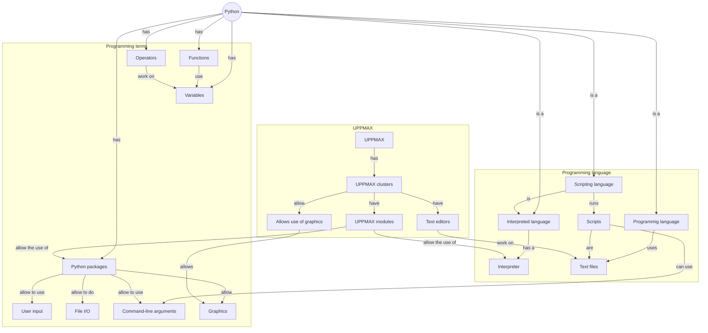

# Overview

This module introduces the fundamentals of Python programming language. 

!!! info "Content"
    * The course emphasises hands-on experience with Python in the UPPMAX
      environment. It focuses on the basics and can be taken by someone *without*
      any prior Python experience.
    * In this morning session, you will learn:
        * How to load and use different version of Python on our clusters
        * How to work with basic builtin data types
        * How to create and run a Python script
    
## Schedule

| Time          | Topic                         | 
|---------------|-------------------------------|
| 09:00-10:00   | [Using the Python interpreter](using_the_python_interpreter.md), [the way of the program](the_way_of_the_program.md) |
| 10:00-10:15   | Break                         |
| 10:15-11:00   | [Working with Python scripts](working_with_python_scripts.md), [variables](variables_expressions_and_statements.md) |
| 11:00-11:15   | Break                         |
| 11:15-12:00   | [operators](variables_expressions_and_statements.md), [user input](variables_expressions_and_statements.md)

Link to HackMd: <https://hackmd.io/@dianai/uppmax-intro/>

## Overview

## Links

 * [YouTube video on `python` versus `IPython`](https://youtu.be/lhi7s6RoIys?si=Z72gSIb6q3piucPH)
 * [YouTube video on `IPython`](https://www.youtube.com/watch?v=S9rgGJYAQ8o)
 * [Free online book: 'How to Think Like a Computer Scientist'](https://openbookproject.net/thinkcs/python/english3e/index.html)
