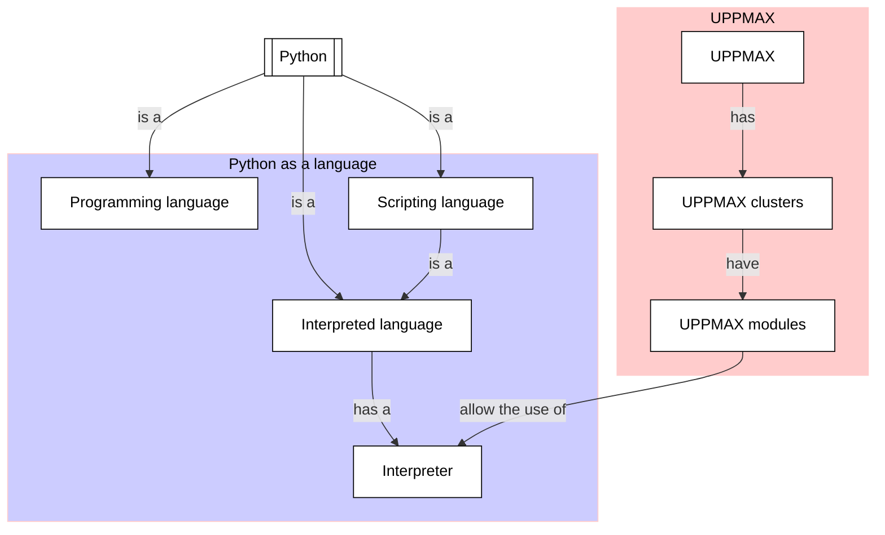

# The way of the program

!!!- info "Learning objectives"

    * Get a first impression of what the Python programming language is
    * Know the basics of what the Python interpreter is
    * Get a first idea of what a program is
    * Hear about the three types of errors
    * Build up experience with the Python interpreter
    * Use a text editor on an UPPMAX HPC cluster
    * Create a Python script
    * Run a Python script

???- question "For teachers"

    Teaching goals are:

    * Learners have a general idea about what the Python programming language is
    * Learners have used the word 'Python interpreter'
    * Learners have a general idea about what a program is
    * Learners have used the terms syntax error, runtime error and semantic error
    * Learners have run code in the Python interpreter

    Other goals are:

    - Verify that learners indeed have learned how to create a file
    - Verify that learners indeed have learned how to use a text editor

    Lesson plan:

    * 5 mins: prior knowledge
    * 5 mins: presentation
    * 15 mins: challenge
    * 5 mins: feedback

## Overview

What is Python? What is a programming language?
What type of errors will I write when programming?
How do I write code in Python?

These fundamental question are discussed and practiced in this session.

## Exercises

### Exercise 1: Python and the Python interpreter

!!!- info "Learning objectives"

    * Get a first impression of what the Python programming language is
    * Know the basics of what the Python interpreter is
    * Get a first idea of what a program is
    * Hear about the three types of errors
    * Build up experience with the Python interpreter

Read the following sections of [How to Think Like a Computer Scientist: Learning with Python 3](https://openbookproject.net/thinkcs/python/english3e/index.html):

 * 1.1 The Python programming language
 * 1.2. What is a program?
 * 1.4. Syntax errors
 * 1.5. Runtime errors
 * 1.6. Semantic errors
 * 1.9. The first program

Then in section 1.12, do exercises 1 to and including 5

### Exercise 2: Running a Python script

!!!- info "Learning objectives"

    - create a Python script
    - run a Python script
    - use a text editor on an UPPMAX HPC cluster

Read the UPPMAX documentation about text editors [here](http://docs.uppmax.uu.se/software/text_editors/).

Then, in the book, section 1.12, do exercise 6.

## Links

 * [How to Think Like a Computer Scientist: Learning with Python 3](https://openbookproject.net/thinkcs/python/english3e/index.html)
