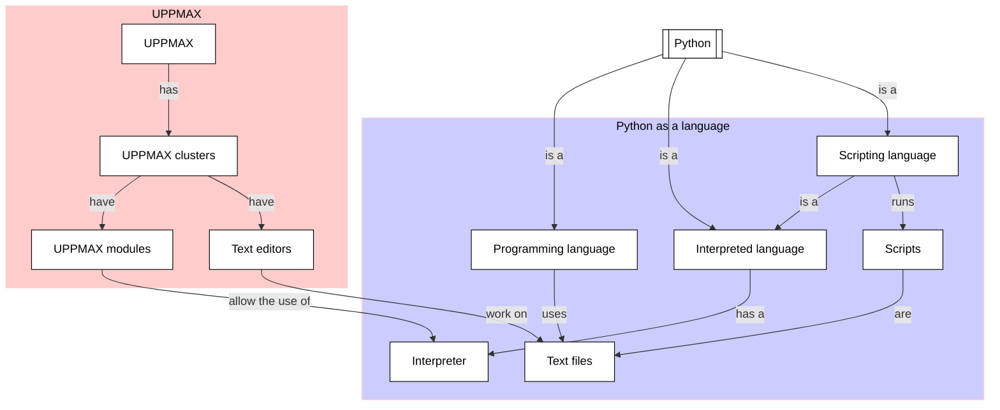

# Working with Python scripts

!!!- info "Learning objectives"

    * To be able to create a Python script
    * To be able to run a Python script

???- question "For teachers"

    Teaching goals are:

    * Learners have created a Python script
    * Learners have run a Python script

    Other goals are:

    - Verify that learners indeed have learned how to create a file
    - Verify that learners indeed have learned how to use a text editor

    Lesson plan:

    * 5 mins: prior knowledge
    * 5 mins: presentation
    * 15 mins: challenge
    * 5 mins: feedback

## Overview

To run code, we use text files that are run as if each line
was typed in into the Python interpreter. Such text files
that run (interpreted) code are called 'scripts'.

In this session, we create and run some simple Python scripts.



## Exercises

See the exercise procedure [here](../misc/exercise_procedure.md).

### Exercise 1: create a Python script

!!!- info "Learning objectives"

    - to use a text editor in the terminal
    - to create, edit and save a file in the terminal
    - to create a trivial Python script to work on

On Rackham, create a file called `hello_world.py`,
using a text editor or Linux commands.
The UPPMAX page on text editors is [here](http://docs.uppmax.uu.se/software/text_editors/).

!!! tip "Use the text editor 'GNU nano'"

Copy-paste the following content into the script:

```python
print('Hello, world!')
```

Save the script.
Close the text editor.
Verify that the script has its contents saved.

### Exercise 2: run a Python script

!!!- info "Learning objectives"

    - to be able to run a Python script.

Read the UPPMAX page on running a Python script, [here](http://docs.uppmax.uu.se/software/python/#running-python)

Run the Python script you just created.

### Exercise 3: run another Python script

!!!- info "Learning objectives"

    - rehearse creating a Python script
    - to observe that an expression result is not shown on-screen by default

Of the Python book
[How to Think Like a Computer Scientist: Learning with Python 3](https://openbookproject.net/thinkcs/python/english3e/index.html),
go back to section 1.12 and do exercise 6.

## Links

* [How to Think Like a Computer Scientist: Learning with Python 3](https://openbookproject.net/thinkcs/python/english3e/index.html)
