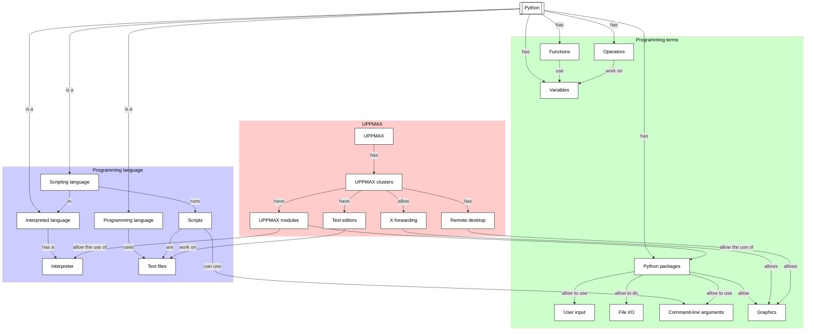

# Overview

This module introduces the fundamentals of Python programming language.

!!! info "Content"
    - The course emphasises hands-on experience with Python in the UPPMAX
      environment. It focuses on the basics and can be taken by someone
      without any prior Python experience.
    - You will learn:
        - :heavy_check_mark: How to load and use different version
          of Python on our clusters
        - :heavy_check_mark: How to create and run a Python script
        - How to work with basic builtin data types
        - How to use UPPMAX modules to load a Python package
        - How to reading files
        - How to writing to files
        - How to creating a command line program that can take input arguments
        - How to use control flow statements
        - How to draw a plot (i.e. an x-y line plot)
        - How to bundle code into reusable functions

??? info "For teachers"

    Classic-style lecture and exercises can be found at [lecture.md](lecture.md)
    and [exercise.md](exercise.md)

## Schedule

Time          | Topic
--------------|------------------------------------------------------------------------------------------------
13:00-14:00   | [Variables, expressions and statements: variables](variables_expressions_and_statements_1.md)  
14:00-14:15   | Break
14:15-15:00   | [Variables, expressions and statements: operators](variables_expressions_and_statements_2.md)  
15:00-15:15   | Break
15:15-16:00   | [Variables, expressions and statements: user input](variables_expressions_and_statements_3.md)

> The course is learner-centered. This means that the pace is determined
> be the learners (i.e. not by the clock).
> The breaks are always on the time specified.

- Extra materials:
    - [UPPMAX modules and Python packages](hello_little_turtles.md)
    - [File IO](files.md)
    - [command line arguments](command_line_arguments.md)
    - [Graphics](graphics.md)
    - [functions](functions.md)
    - Conditionals
      (['How to Think Like a Computer Scientist'](https://openbookproject.net/thinkcs/python/english3e/index.html)
      chapter 5)
    - Fruitful functions
      (['How to Think Like a Computer Scientist'](https://openbookproject.net/thinkcs/python/english3e/index.html)
      chapter 6)
    - Other Python programming environments:
      see the UPPMAX 'Programming in Python' documentation
      [here](http://docs.uppmax.uu.se/software/python_programming/)

## Overview of afternoon

> Overview of all topics discussed in the afternoon
