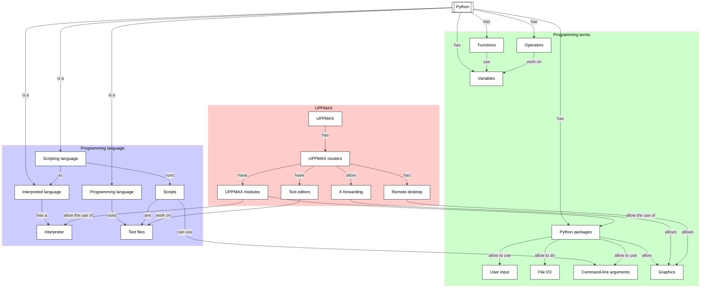

# Functions

!!!- info "Learning outcomes"

    - Use a for loop
    - Write a function without an argument and without a return type
    - Write a function that calls a function
    - Write a function that requires an argument
    - Write a function with a return value

???- question "For teachers"

    Teaching goals are:

    - Learners have used a for loop
    - Learners have written functions

    Lesson plan:

    - 5 mins: prior knowledge
    - 5 mins: presentation
    - 15 mins: challenge
    - 5 mins: feedback

    Prior:

    - What are functions?
    - Why use functions?
    - Can you name some Python functions?

## Overview

Sometime you need to do a same multi-line calculation multiple times in your code.
Instead of copy-pasting, one can use a so-called 'function'
to bundle a calculation is something that can be reused.

## Exercises

See the exercise procedure [here](../misc/exercise_procedure.md).

### Exercise 1: using a for loop

!!!- info "Learning outcomes"

    - Use a for loop

Read the following sections of
[How to Think Like a Computer Scientist: Learning with Python 3](https://openbookproject.net/thinkcs/python/english3e/index.html):

- 3.2. Instances — a herd of turtles
- 3.3. The for loop
- 3.4. Flow of Execution of the for loop
- 3.5. The loop simplifies our turtle program

Then do exercise

- 3.8.1
- 3.8.5

### Exercise 2: a simple function

!!!- info "Learning outcomes"

    - Write a function without an argument and without a return type

Read the following sections of
[How to Think Like a Computer Scientist: Learning with Python 3](https://openbookproject.net/thinkcs/python/english3e/index.html):

- 4.1. Functions

Then do exercise:

- 4.9.1

### Exercise 3: write a function that calls a function

!!!- info "Learning outcomes"

    - Write a function that calls a function

Read the following sections of
[How to Think Like a Computer Scientist: Learning with Python 3](https://openbookproject.net/thinkcs/python/english3e/index.html):

- 4.2. Functions can call other functions

Then do exercise:

- 4.9.2

### Exercise 3: write a function that requires an argument

!!!- info "Learning outcomes"

    - Write a function that requires an argument

Read the following sections of
[How to Think Like a Computer Scientist: Learning with Python 3](https://openbookproject.net/thinkcs/python/english3e/index.html):

- 4.4. Functions that require arguments

Then do exercise:

- 4.9.3

### Exercise 4: write a function with a return value

!!!- info "Learning outcomes"

    - Write a function with a return value

Read the following sections of
[How to Think Like a Computer Scientist: Learning with Python 3](https://openbookproject.net/thinkcs/python/english3e/index.html):

- 4.5. Functions that return values

Then do exercise:

- 4.9.7
- 4.9.8

## Links

- [How to Think Like a Computer Scientist: Learning with Python 3](https://openbookproject.net/thinkcs/python/english3e/index.html)
