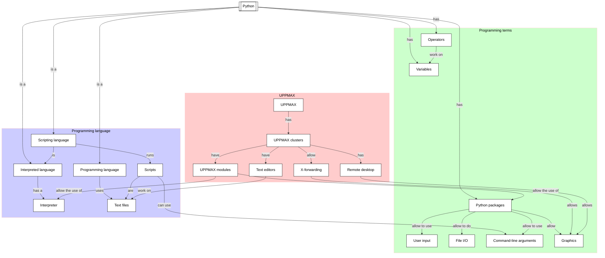

# Graphics

!!!- info "Learning objectives"

    - Make a first scatter plot
    - Rehearse running a script that uses an import
    - Rehearse that graphics need X-forwarding

???- question "For teachers"

    Teaching goals are:

    * Learners hear about matplotlib
    * Learners may find out again that X-forwarding is important
    * Learners again have gotten 'stuff to work'

    Lesson plan:

    * 5 mins: prior knowledge
    * 5 mins: presentation
    * 15 mins: challenge
    * 5 mins: feedback

    Prior:

    - What is meant with a plotting library?
    - What is meant with a plotting package/module?
    - Can you name a Python plotting package?

## Overview

Sometimes one wants to make a plot, such like a scatterplot or barchart.
Matplotlib is a popular Python package to make plots.
Here we experience how easy/hard it is to use Matplotlib on Rackham.

## Exercises

See the exercise procedure [here](../misc/exercise_procedure.md).

### Exercise 1: Use matplotlib to show a plot

!!!- info "Learning objectives"

    - Make a first scatter plot
    - Rehearse running a script that uses an import
    - Rehearse that graphics need X-forwarding

Read matplotlib's 'Pyplot tutorial' [here](https://matplotlib.org/stable/tutorials/pyplot.html#sphx-glr-tutorials-pyplot-py).

Copy-paste the first script on that page to a script and get it to work.
Do you expect this to be easy?
