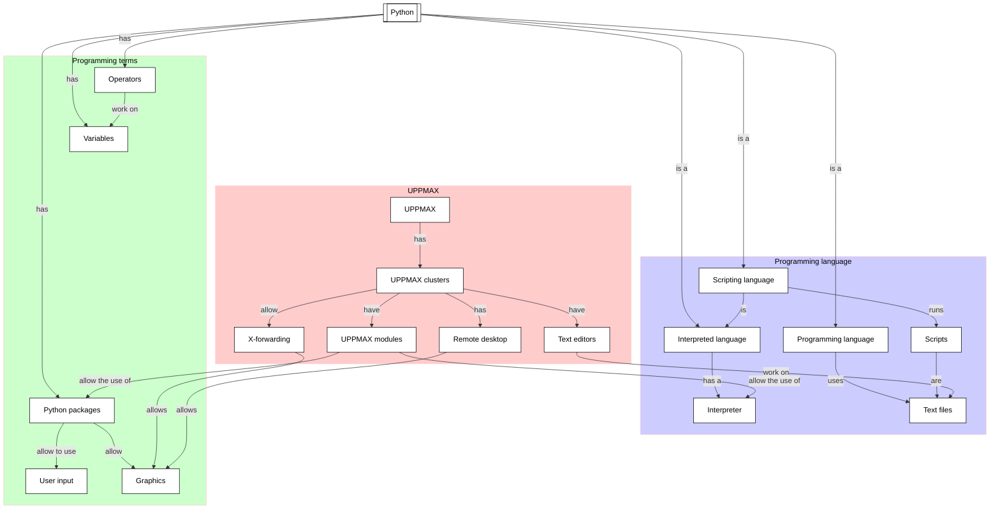
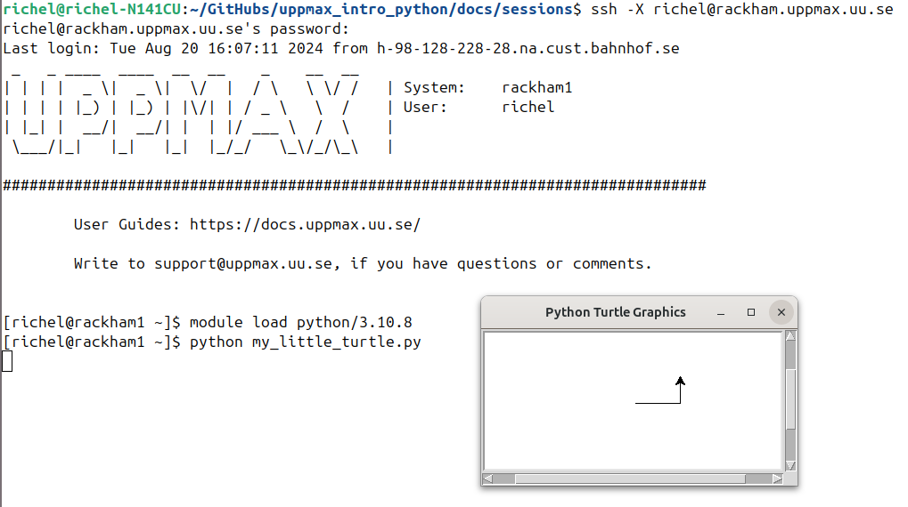

# Hello, little turtles

!!!- info "Learning objectives"

    - Practice using the UPPMAX documentation
    - Practice using the Python book
      [How to Think Like a Computer Scientist: Learning with Python 3](https://openbookproject.net/thinkcs/python/english3e/index.html)
    - Have a first 'Get stuff to work' experience
    - Rehearse creating a script
    - Experience when importing a Python package gives an error
    - Search for an UPPMAX module that needs to be loaded
    - Import a Python package successfully

???- question "For teachers"

    Teaching goals are:

    - Learners have observed the error when importing a Python package
      without the needed UPPMAX module loaded
    - Learners have search through the UPPMAX modules
    - Learners may find out that X-forwarding is important
    - Learners have gotten 'stuff to work'

    Other goals are:

    - Verify that learners indeed have learned how to login with X-forwarding.
      Redirect to remote desktop environment as a solution

    Lesson plan:

    - 5 mins: prior knowledge
    - 5 mins: presentation
    - 25 mins: challenge
    - 5 mins: feedback

## Overview

Sometime you need to get 'stuff to work', for example,
code written by someone else.
In this session, we practice this,
going through the problems and errors that occur
when you want to 'just want to run the stupid code'.



## Exercises

See the exercise procedure [here](../misc/exercise_procedure.md).

### Exercise 1: Fail at running a first program

!!!- info "Learning objectives"

    - Rehearse creating a script
    - Try to import a Python package
    - Observe errors when a package is absent,
      due to a module not being loaded

Read the following sections of
[How to Think Like a Computer Scientist: Learning with Python 3](https://openbookproject.net/thinkcs/python/english3e/index.html):

- 3.1. Our first turtle program

Then:

- Log in to Rackham using SSH **without** X forwarding

???- question "Answer"

    This is how:

    ```bash
    ssh sven@rackham.uppmax.uu.se
    ```

- Do **not** load a Python mododule: it is the point of this exercise
  to see what happens if you forget to do so!

- Copy-paste the first script in that section to a script on Rackham.
  Below is a copy of that script:

```python
import turtle             # Allows us to use turtles
wn = turtle.Screen()      # Creates a playground for turtles
alex = turtle.Turtle()    # Create a turtle, assign to alex

alex.forward(50)          # Tell alex to move forward by 50 units
alex.left(90)             # Tell alex to turn by 90 degrees
alex.forward(30)          # Complete the second side of a rectangle

wn.mainloop()             # Wait for user to close window
```

- Run the script on Rackham using `python3` and without loading
  any modules. Does the error message make sense?

???- question "Why use `python3` instead of `python`?"

    Because `python` happens to have access to the `turtle`
    library, hence it gives the error of the next exercise
    directly

???- question "Answer"

    Here is the error:

    ```bash
    [richel@rackham3 ~]$ python3 my_little_turtle.py 
    Traceback (most recent call last):
      File "my_little_turtle.py", line 1, in <module>
        import turtle             # Allows us to use turtles
    ModuleNotFoundError: No module named 'turtle'
    ```

    It does mean that the `turtle` package is not available.
    That is correct: the `python` module (with many packages)
    has not been loaded yet!

### Exercise 2: Fail at running a first program again

!!!- info "Learning objectives"

    - Rehearse creating a script
    - Try to import a Python package
    - Observe errors when X forwarding is not enabled

- Log in to Rackham using SSH **without** X forwarding

???- question "Answer"

    This is how:

    ```bash
    ssh sven@rackham.uppmax.uu.se
    ```

- Run the script on Rackham and verify it will not run.
  Does the error message make sense?

???- question "Answer"

    This is what will happen:

    <!-- An unavoidable long line -->
    <!-- markdownlint-disable MD013 -->

    Log in without X forwarding:

    ```bash
    richel@richel-N141CU:~/GitHubs/uppmax_intro_python/docs/sessions$ ssh richel@rackham.uppmax.uu.se
    richel@rackham.uppmax.uu.se's password: 
    ```

    Output:

    ```bash
    Last login: Fri Aug 16 09:49:42 2024 from h-98-128-228-28.na.cust.bahnhof.se
     _   _ ____  ____  __  __    _    __  __
    | | | |  _ \|  _ \|  \/  |  / \   \ \/ /   | System:    rackham2
    | | | | |_) | |_) | |\/| | / _ \   \  /    | User:      richel
    | |_| |  __/|  __/| |  | |/ ___ \  /  \    | 
     \___/|_|   |_|   |_|  |_/_/   \_\/_/\_\   | 

    ###############################################################################

            User Guides: https://docs.uppmax.uu.se/

            Write to support@uppmax.uu.se, if you have questions or comments.
    ```

    <!-- markdownlint-enable MD013 -->

    Loading the `python/3.10.8` module, which is good practice
    (yet irrelevant for the error message):

    ```bash
    [richel@rackham2 ~]$ module load python/3.10.8
    ```

    Running the script:

    <!-- An unavoidable long line -->
    <!-- markdownlint-disable MD013 -->

    ```bash
    [richel@rackham2 ~]$ python my_little_turtle.py 
    Traceback (most recent call last):
      File "/domus/h1/richel/my_little_turtle.py", line 2, in <module>
        wn = turtle.Screen()      # Creates a playground for turtles
      File "/sw/comp/python/3.10.8/rackham/lib/python3.10/turtle.py", line 3664, in Screen
        Turtle._screen = _Screen()
      File "/sw/comp/python/3.10.8/rackham/lib/python3.10/turtle.py", line 3680, in __init__
        _Screen._root = self._root = _Root()
      File "/sw/comp/python/3.10.8/rackham/lib/python3.10/turtle.py", line 435, in __init__
        TK.Tk.__init__(self)
      File "/sw/comp/python/3.10.8/rackham/lib/python3.10/tkinter/__init__.py", line 2299, in __init__
        self.tk = _tkinter.create(screenName, baseName, className, interactive, wantobjects, useTk, sync, use)
    _tkinter.TclError: no display name and no $DISPLAY environment variable
    [richel@rackham2 ~]$ 
    ```

    <!-- markdownlint-enable MD013 -->

    The error is `no display name and no $DISPLAY environment variable`.
    In simpler terms, this can be read as 'Nothing to show graphics with'.

    The solution is to login to Rackham with X forwarding enabled

### Exercise 3: Running a first program

!!!- info "Learning objectives"

    - Import a Python package
    - Practice to search for an UPPMAX module that needs to be loaded
    - Get a script that requires an UPPMAX module to be loaded to work

Now we try to make this script work!

Read:

- [the UPPMAX documentation 'Loading Python packages'](http://docs.uppmax.uu.se/software/python/#loading-python-packages)
- [the UPPMAX documentation 'Modules'](http://docs.uppmax.uu.se/cluster_guides/modules/)

Now, try to get the script to work.

When running the code, there should be a visible pop-up window. If not,
re-read
[the UPPMAX documentation page 'Login to Rackham'](http://docs.uppmax.uu.se/getting_started/login_rackham/)
and enable X-forwarding. If X-forwarding does not work,
use the Rackham remote desktop environment.

???- question "Need more hints?"

    The exercise is about *practicing* to search for an UPPMAX module,
    hence giving away the answer makes this session useless.

    However, if you feel stuck too much, 
    you can watch a video in which this exercise is done
    [here](https://youtu.be/bnN-1uzsgvk)

- Log in to Rackham using SSH with X forwarding. How does it look?

???- question "Answer"

    This is how to log in with X forwarding enabled:

    ```bash
    ssh -X sven@rackham.uppmax.uu.se
    ```

    It looks like this:

    


## Links

- [How to Think Like a Computer Scientist: Learning with Python 3](https://openbookproject.net/thinkcs/python/english3e/index.html)
