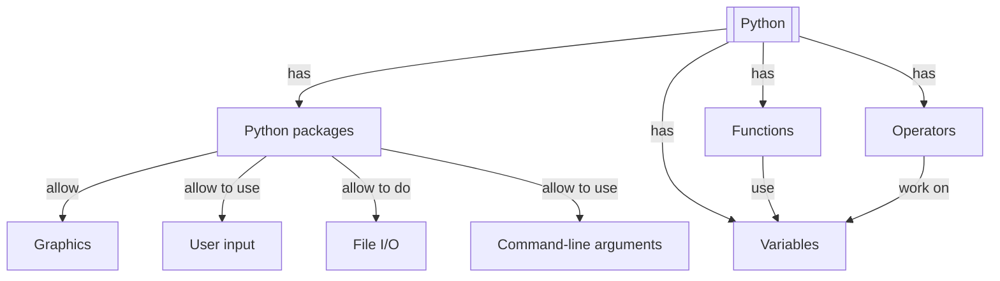

# Overview

This module introduces the fundamentals of Python programming language.

!!! info "Content"
    - The course emphasises hands-on experience with Python in the UPPMAX
      environment. It focuses on the basics and can be taken by someone
      without any prior Python experience.
    - You will learn:
        - :heavy_check_mark: How to load and use different version
          of Python on our clusters
        - :heavy_check_mark: How to create and run a Python script
        - How to work with basic builtin data types
        - How to use UPPMAX modules to load a Python package
        - How to reading files
        - How to writing to files
        - How to creating a command line program that can take input arguments
        - How to use control flow statements
        - How to draw a plot (i.e. an x-y line plot)
        - How to bundle code into reusable functions

??? info "For teachers"

    Classic-style lecture and exercises can be found at [lecture.md](lecture.md)
    and [exercise.md](exercise.md)

- [Variables, expressions and statements, variables](variables_expressions_and_statements_1.md)
- [Variables, expressions and statements, operators](variables_expressions_and_statements_2.md)
- [Variables, expressions and statements, user input](variables_expressions_and_statements_3.md)
- [UPPMAX modules and Python packages](hello_little_turtles.md)
- [File IO](files.md)
- [command line arguments](command_line_arguments.md)
- [Graphics](graphics.md)
- [functions](functions.md)
