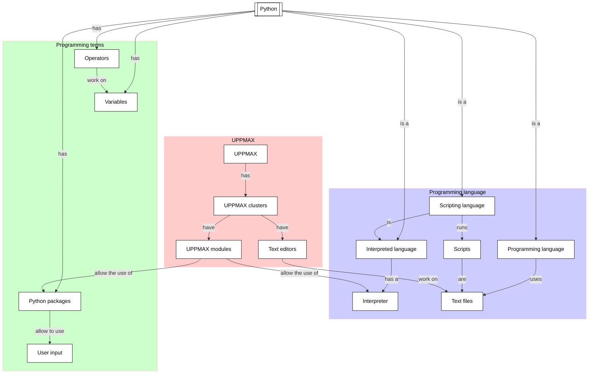

# Getting it to run

This module introduces the fundamentals of Python programming language.

!!!- info "Learning objectives"

    - Practice using the UPPMAX documentation
    - Practice using the Python book
      [How to Think Like a Computer Scientist: Learning with Python 3](https://openbookproject.net/thinkcs/python/english3e/index.html)
    - Get Python code to run on the UPPMAX clusters
    - Develop Python code on the UPPMAX clusters
    - Understand the minimum of Python

??? info "For teachers"

    Classic-style lecture and exercises can be found at <morning_lecture.md>
    and <morning_exercise.md>

- [Using the Python interpreter](using_the_python_interpreter.md)
- [the way of the program](the_way_of_the_program.md)
- [Working with Python scripts](working_with_python_scripts.md)
