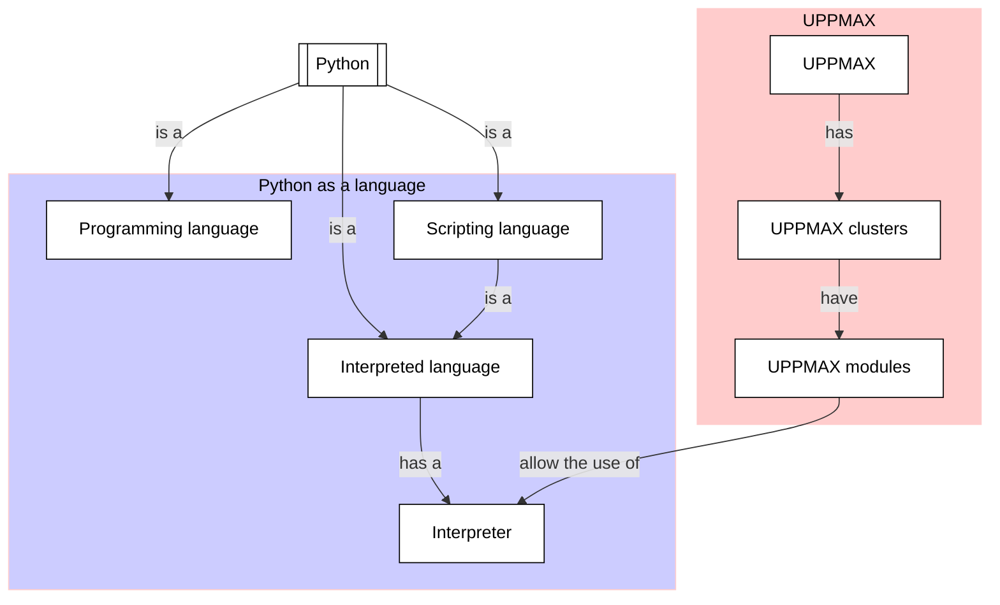

# Using the Python interpreter

!!!- info "Learning objectives"

    - Practice using the UPPMAX documentation
    - Practice using the Python book
      [How to Think Like a Computer Scientist: Learning with Python 3](https://openbookproject.net/thinkcs/python/english3e/index.html)
    - To be able to login to Rackham autonomously
    - To be able to load a Python version autonomously
    - to be able to start an interactive session autonomously
    - To be able to run a minimal Python program autonomously

???- question "For teachers"

    Teaching goals are:

    - Learners have used the UPPMAX documentation
    - Learners have used the Python interpreter
    - Learners have loaded Python using the module system

    Other goals are:

    - Verify that learners indeed have learned how to login
    - Verify that learners indeed have learned how to start an interactive session
    - Verify that learners indeed have learned how to use the module system

    Lesson plan:

    * 5 mins: prior knowledge
    * 5 mins: presentation
    * 15 mins: challenge
    * 5 mins: feedback

## Why?

You want to make a computer run Python code,
for some good reason. Here we do so!

To develop code in Python on the UPPMAX clusters, one needs to:

- Login to Rackham, to be on an UPPMAX cluster
- Load the Python module, to be able to use a modern Python interpreter
- Use the Python interpreter, to run Python code

Luckily, UPPMAX has documentation that should allow you to do so yourself!

These exercises will ensure you are able to run a minimal Python program.



## Exercises

???- question "Enjoy a video?"

    You can find a video with solutions to these exercises
    [here](https://youtu.be/S6pYTqRmI7U)

See the exercise procedure [here](../misc/exercise_procedure.md).

### Exercise 1: login to Rackham

Go to the UPPMAX documentation at
[https://docs.uppmax.uu.se](https://docs.uppmax.uu.se),
then answer these questions:

- Login to Rackham in any way

???- question "Anwer"

    This is described at
    [the UPPMAX page 'Login to Rackham'](http://docs.uppmax.uu.se/getting_started/login_rackham/):

    - Remote desktop via website: go to <https://rackham-gui.uppmax.uu.se>
    - Using SSH: 

    ```bash
    ssh -X sven@rackham.uppmax.uu.se
    ```

### Exercise 2: start an interactive session

!!!- info "Learning objectives"

    - to be able to start an interactive session autonomously

Go to the UPPMAX documentation at
[https://docs.uppmax.uu.se](https://docs.uppmax.uu.se),
then answer these questions:

- Start an interactive session of max four hours

If this does not work out, go to the next step:
we will be only doing light work on the login node.
However, using an interactive session is a good idea.

???- question "Anwer"

    This is described at
    [the UPPMAX page 'Starting an interactive node on Rackham'](http://docs.uppmax.uu.se/cluster_guides/start_interactive_node_on_rackham/):

    ```bash
    interactive -A naiss2024-22-49 -t 4:00:00
    ```

### Exercise 3: load the Python module

!!!- info "Learning objectives"

    - to be able to load a Python version autonomously

Go to the UPPMAX documentation at
[https://docs.uppmax.uu.se](https://docs.uppmax.uu.se),
then answer these questions:

- Load Python version 3.10.8

???- question "Anwer"

    This is described at
    [the UPPMAX pages on Python](http://docs.uppmax.uu.se/software/python/):

    ```bash
    module load python/3.10.8
    ```

### Exercise 4: write a 'Hello world' program

!!!- info "Learning objectives"

    - to be able to run a minimal Python program autonomously

Go to the UPPMAX documentation at
[https://docs.uppmax.uu.se](https://docs.uppmax.uu.se),
then answer these questions:

- Start Python on Rackham

???- question "Answer"

    Type

    ```bash
    python
    ```

    to start the Python interpreter


- Find the UPPMAX documentation page on Python programming

???- question "Answer"

    It can be found at <https://docs.uppmax.uu.se/software/python_programming/>

- On the UPPMAX documentation page on Python programming, find out how to
  run a 'Hello world' program from the interpreter. Then do this yourself

???- question "Answer"

    The documentation can be found at
    <https://docs.uppmax.uu.se/software/python_programming/#use-the-python-interpreter>.

    In the Python interpreter, type

    ```python
    print('Hello, world!')
    ```

    to run your 'Hello world' program
