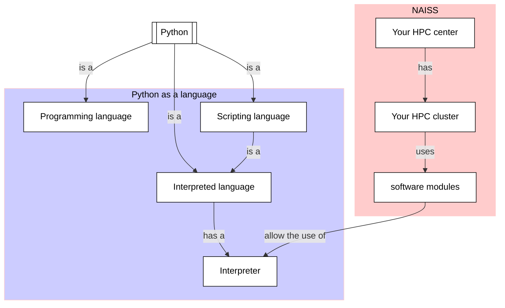

# Using the Python interpreter

!!!- info "Learning outcomes"

    - Practice using the documentation of your HPC cluster
    - Practice using the Python book
      [How to Think Like a Computer Scientist: Learning with Python 3](https://openbookproject.net/thinkcs/python/english3e/index.html)
    - To be able to login to your HPC cluster
    - To be able to load Python
    - To be able to run a minimal Python program

???- question "For teachers"

    Teaching goals are:

    - Learners have used the documentation of their HPC cluster
    - Learners have used the Python book
    - Learners have used the Python interpreter
    - Learners have loaded Python

    Other goals are:

    - Verify that learners indeed have learned how to login
    - Verify that learners indeed have learned how to use the module system

    Prior and feedback question:

    - What is Python?
    - What are features of the Python language?
    - What is an interpreted language?
    - What is a scripting language?
    - What is an interpreter?
    - What is an HPC cluster?
    - What are features of your HPC cluster?
    - What is a login node?
    - What is the rule on what to run on a login node?
    - How to run heavy Python calculations on your HPC cluster?
    - How to make your Python scripts reproducible?

    Lesson plan:

    - 5 mins: prior knowledge
    - 5 mins: presentation
    - 15 mins: challenge
    - 5 mins: feedback

    Notes:

    - For those that use Bianca, it may take some time to get a login node.
      Encourage those to try Rackham while waiting

## Why?

You want to make a computer run Python code,
for some good reason. Here we do so!

To develop code in Python on your HPC clusters, one needs to:

- Login to that HPC cluster, to be able to work on it
- Load the Python module, to be able to use a modern Python interpreter
- Use the Python interpreter, to run Python code

Luckily, the documentation of your HPC center
should allow you to do this by yourself!

These exercises will ensure you are able to run a minimal Python program.



## Exercises

???- question "Enjoy a video?"

    You can find a video with solutions to these exercises:

    HPC Cluster|Login method|Link to video
    -----------|------------|------------------------------------
    Alvis      |SSH         |[here](https://youtu.be/R_RxKo-Vma4)
    Bianca     |SSH         |[here](https://youtu.be/80AG-4niBgk)
    COSMOS     |SSH         |[here](https://youtu.be/aqqHUvvolds)
    Dardel     |SSH         |[here](https://youtu.be/BAD6y_a5xBQ)
    Kebnekaise |SSH         |[here](https://youtu.be/DpnKUEOcIdE)
    LUMI       |SSH         |To do
    Rackham    |SSH         |[here](https://youtu.be/S6pYTqRmI7U)
    Tetralith  |SSH         |[here](https://youtu.be/OBT9XuVktwg)

### Exercise 1: login to your HPC cluster

Go to the documentation of your HPC cluster
and search for the login procedure(s).

Then answer these questions:

- Login to your HPC cluster in any way

???- question "Answer"

    The documentation for the your HPC cluster can be found at:

    HPC Cluster|Link to documentation
    -----------|------------------------------------------------------
    Alvis      |[here](https://www.c3se.chalmers.se/)
    Bianca     |[here](https://docs.uppmax.uu.se)
    COSMOS     |[here](https://lunarc-documentation.readthedocs.io/en/latest/)
    Dardel     |[here](https://support.pdc.kth.se/doc/support)
    Kebnekaise |[here](https://docs.hpc2n.umu.se)
    LUMI       |To do
    Rackham    |[here](https://docs.uppmax.uu.se)
    Tetralith  |[here](https://www.nsc.liu.se/support/systems/tetralith-getting-started/)

    From there, searching for, for example, 'login', you will find information
    on how to do so.

    HPC Cluster|Link to documentation
    -----------|------------------------------------------------------
    Alvis      |[here](https://www.c3se.chalmers.se/documentation/for_users/getting_started/how_to_login_to_alvis/)
    Bianca     |[here](https://docs.uppmax.uu.se/getting_started/login_bianca_console_password/)
    COSMOS     |[here](https://lunarc-documentation.readthedocs.io/en/latest/getting_started/login_howto/)
    Dardel     |:warning: [here](https://support.pdc.kth.se/doc/support/)
    Kebnekaise |[here](https://docs.hpc2n.umu.se/documentation/access/#login__and__file__transfer)
    LUMI       |To do
    Rackham    |[here](http://docs.uppmax.uu.se/getting_started/login_rackham/)
    Tetralith  |[here](https://www.nsc.liu.se/support/getting-started/)

    - :warning: means that there is either no direct to the documentation
      and/or the documentation present is incomplete.
      You are encouraged
      to contact your HPC center to help them help you better

### Exercise 2: load the Python module

Go to the documentation of your HPC cluster
and load a Python software module.

???- question "Answer"

    From the documentation of your center, searching for, for example,
    'Python module',
    you will find information on how to load the Python module.

    <!-- markdownlint-disable MD013 --><!-- Tables cannot be split up over lines, hence will break 80 characters per line -->

    HPC Cluster|Link to documentation                                                                              |Solution
    -----------|---------------------------------------------------------------------------------------------------|------------------------------------------------------
    Alvis      |:warning: None, closest is [here](https://www.c3se.chalmers.se/documentation/applications/modules/)|`module load Python/3.12.3-GCCcore-13.3.0`
    Bianca     |[here](https://docs.uppmax.uu.se/software/python/#loading-python)                                  |`module load python/3.11.4`
    COSMOS     |[here](https://lunarc-documentation.readthedocs.io/en/latest/guides/applications/Python/)          |`module load GCCcore/13.2.0 Python/3.11.5`
    Dardel     |:warning: [here](https://support.pdc.kth.se/doc/support/)                                          |`module load bioinfo-tools python/3.11.4`
    Kebnekaise |[here](https://docs.hpc2n.umu.se/tutorials/userinstalls/#python__packages)                         |`module load GCC/12.3.0 Python/3.11.3`
    LUMI       |To do                                                                                              |To do
    Rackham    |[here](http://docs.uppmax.uu.se/software/python/)                                                  |`module load python`
    Tetralith  |[here](https://www.nsc.liu.se/software/python/)                                                    |`module load Python/3.10.4-env-hpc2-gcc-2022a-eb`

    <!-- markdownlint-enable MD013 -->

    - :warning: means that there is either no direct to the documentation
      and/or the documentation present is incomplete.
      You are encouraged
      to contact your HPC center to help them help you better

### Exercise 3: start the Python interpreter

Go to the documentation of your HPC cluster
and start the Python interpreter.

???- question "Answer"

    From the documentation of your center, searching for, for example,
    'Python' or 'Python interpreter',
    you will find information on how to start the Python interpreter.

    <!-- markdownlint-disable MD013 --><!-- Tables cannot be split up over lines, hence will break 80 characters per line -->

    HPC Cluster|Link to documentation                                                                              |Solution
    -----------|---------------------------------------------------------------------------------------------------|------------------------------------------------------
    Alvis      |:warning: [here](https://www.c3se.chalmers.se/documentation/applications/python/)                  |`python`
    Bianca     |[here](https://docs.uppmax.uu.se/software/python/#loading-python)                                  |`python`
    COSMOS     |:warning: [here](https://lunarc-documentation.readthedocs.io/en/latest/guides/applications/Python/)|`python`
    Dardel     |:warning: [here](https://support.pdc.kth.se/doc/support/)                                          |`python`
    Kebnekaise |:warning: [here](https://docs.hpc2n.umu.se/tutorials/userinstalls/#python__packages)               |`python`
    LUMI       |To do                                                                                              |To do
    Rackham    |[here](https://docs.uppmax.uu.se/software/python/#loading-python)                                  |`python`
    Tetralith  |[here](https://www.nsc.liu.se/software/python/)                                                    |`python`

    <!-- markdownlint-enable MD013 -->

    - :warning: means that there is either no direct to the documentation
      and/or the documentation present is incomplete.
      You are encouraged
      to contact your HPC center to help them help you better

???- question "Cannot get this to work?"

    If there is no time to get this fixed during the course,
    you are also use Python on your local computer.

### Exercise 4: run a 'Hello world' program

Copy-paste the following code to the Python interpreter:

```python
print('Hello, world!')
```

Press enter.

How does that look like?

???- question "Answer"

    You output will look similar to this:

    ```python
    $ python
    Python 3.12.3 (main, Nov  6 2024, 18:32:19) [GCC 13.2.0] on linux
    Type "help", "copyright", "credits" or "license" for more information.
    >>> print('Hello, world!')
    Hello, world!
    >>> 
    ```

Congratulations, you've just run a 'Hello world' program :+1:
