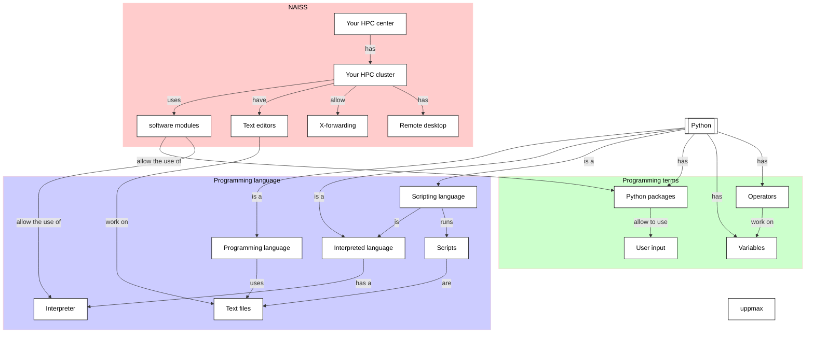

# Variables, expressions and statements: variables

!!!- info "Learning outcomes"

    - Practice using the UPPMAX documentation
    - Practice using the Python book
      [How to Think Like a Computer Scientist: Learning with Python 3](https://openbookproject.net/thinkcs/python/english3e/index.html)
    - Get the type of an object
    - Create a variable
    - Use a variable
    - Practice converting an equation to Python code

???- question "For teachers"

    Teaching goals are:

    - Learners have worked with variables
    - Learners understand the purpose of variables
    - Learners have obtained the data type of a variable
    - Learners have heard about what a data type is
    - Learners have practiced convert an equation and a text question to Python

    Lesson plan:

    Exercises:

    - 5 mins: prior knowledge
    - 5 mins: presentation
    - 15 mins: challenge
    - 5 mins: feedback

    Prior questions:

    - What is a data type?
    - Can you name a Python data type?
    - What is an object?
    - What is a variable?
    - What are rules for naming a variables?
    - What are good practices for the name of a variable?
    - What is an operator?
    - Can you name an operator?

## Overview

In any non-trivial calculation, we want to let our computer remember
things, such as the content of a data file, or the parameters/settings
we use in our program. Variables allows one to make a computer
store ('remember') information. Here we use our first simple variables.

Also we practice converting an equation and a mathematical problem
to Python code. We will discover the helpful modulo operator.




## Exercises

See the exercise procedure [here](../misc/exercise_procedure.md).

### Exercise 1: working with variables

!!!- info "Learning outcomes"

    - get the type of an object
    - create a variable
    - use a variable

Read the following sections of
[How to Think Like a Computer Scientist: Learning with Python 3](https://openbookproject.net/thinkcs/python/english3e/index.html):

- 2.1. Values and data types
- 2.2. Variables
- 2.3. Variable names and keywords

Then in section 2.14, do exercises 1 to and including 4.

!!! question "2.14.1"

    Take the sentence: 'All work and no play makes Jack a dull boy'.
    Store each word in a separate variable,
    then print out the sentence on one line using print.

???- question "Answer"

    ```python
    a = 'All'
    b = 'work'
    c = 'and'
    d = 'no'
    e = 'play'
    f = 'makes'
    g = 'Jack'
    h = 'a'
    i = 'dull'
    j = 'boy'
    print(a, b, c, d, e, f, g, h, i, j)    
    ```


!!! question "2.14.2"

    Add parenthesis to the expression `6 * 1 - 2`
    to change its value from 4 to -6.

???- question "Answer"

    ```python
    6 * (1 - 2)
    ```

!!! question "2.14.3"

    Place a comment before a line of code that previously worked,
    and record what happens when you rerun the program.

???- question "Answer"

    I use this code as a starting point:

    ```python
    a = 'All'
    b = 'work'
    c = 'and'
    d = 'no'
    e = 'play'
    f = 'makes'
    g = 'Jack'
    h = 'a'
    i = 'dull'
    j = 'boy'
    print(a, b, c, d, e, f, g, h, i, j)    
    ```

    Commenting out the first line:

    ```text
        print(a, b, c, d, e, f, g, h, i, j)
              ^
    NameError: name 'a' is not defined
    ```

    Commenting out the last line results in no sentence being printed.

!!! question "2.14.4"

    Start the Python interpreter and enter bruce + 4 at the prompt.
    This will give you an error:

    ```text
    NameError: name 'bruce' is not defined
    ```

    Assign a value to `bruce` so that `bruce + 4` evaluates to 10.

???- question "Answer"

    Here is a solution:

    ```python
    bruce = 6
    print(bruce + 4)
    ```
