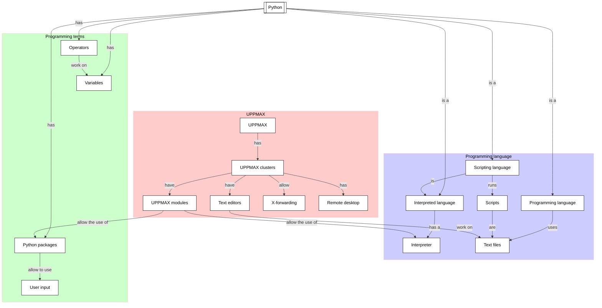

# Variables, expressions and statements: operators

!!!- info "Learning objectives"

    - Practice using the UPPMAX documentation
    - Practice using the Python book
      [How to Think Like a Computer Scientist: Learning with Python 3](https://openbookproject.net/thinkcs/python/english3e/index.html)
    - Get the type of an object
    - Create a variable
    - Use a variable
    - Practice converting an equation to Python code
    - Find and use the operator for exponentiation
    - Practice the modulo operator
    - Practice converting a simple text question to Python code

???- question "For teachers"

    Teaching goals are:

    * Learners have worked with variables
    * Learners understand the purpose of variables
    * Learners have obtained the data type of a variable
    * Learners have heard about what a data type is
    * Learners have practiced convert an equation and a text question to Python
    * Learners have read on operators
    * Learners have worked with the modulo operator

    Lesson plan:

    Exercise 1:

    * 5 mins: prior knowledge
    * 5 mins: presentation
    * 15 mins: challenge
    * 5 mins: feedback

    Exercise 2 and 3:

    * 5 mins: prior knowledge
    * 5 mins: presentation
    * 15 mins: challenge
    * 5 mins: feedback

    Exercise 4:

    * 5 mins: prior knowledge
    * 5 mins: presentation
    * 15 mins: challenge
    * 5 mins: feedback

## Overview

In any non-trivial calculation, we want to let our computer remember
things, such as the content of a data file, or the parameters/settings
we use in our program. Variables allows one to make a computer
store ('remember') information. Here we use our first simple variables.

Also we practice converting an equation and a mathematical problem
to Python code. We will discover the helpful modulo operator.




## Exercises

See the exercise procedure [here](../misc/exercise_procedure.md).

### Exercise 1: an equation with exponentiation

!!!- info "Learning objectives"

    - practice converting an equation to Python code
    - find and use the operator for exponentiation

Read the following sections of
[How to Think Like a Computer Scientist: Learning with Python 3](https://openbookproject.net/thinkcs/python/english3e/index.html):

- 2.6. Operators and operands

Then in section 2.14, do exercise 5
**except for asking for input:
use a hardcoded value as input**, for example:

```python
t = 3.14
```

### Exercise 2: the modulo operator

!!!- info "Learning objectives"

    - practice the modulo operator
    - practice converting a simple text question to Python code

Read the following sections of
[How to Think Like a Computer Scientist: Learning with Python 3](https://openbookproject.net/thinkcs/python/english3e/index.html):

- 2.8. Order of operations
- 2.12. The modulus operator

Then in section 2.14, do exercises 5 and 6.
