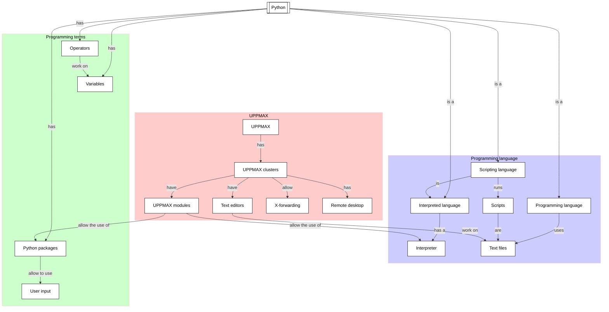

# Variables, expressions and statements: operators

!!!- info "Learning objectives"

    - Practice using the UPPMAX documentation
    - Practice using the Python book
      [How to Think Like a Computer Scientist: Learning with Python 3](https://openbookproject.net/thinkcs/python/english3e/index.html)
    - Get the type of an object
    - Create a variable
    - Use a variable
    - Practice converting an equation to Python code
    - Find and use the operator for exponentiation
    - Practice the modulo operator
    - Practice converting a simple text question to Python code

???- question "For teachers"

    Teaching goals are:

    * Learners have worked with variables
    * Learners understand the purpose of variables
    * Learners have obtained the data type of a variable
    * Learners have heard about what a data type is
    * Learners have practiced convert an equation and a text question to Python
    * Learners have read on operators
    * Learners have worked with the modulo operator

    Lesson plan:

    Exercises:

    * 5 mins: prior knowledge
    * 5 mins: presentation
    * 15 mins: challenge
    * 5 mins: feedback

    Prior questions:

    - When is it important to know the data type of an object?

    

## Overview

In any non-trivial calculation, we want to let our computer remember
things, such as the content of a data file, or the parameters/settings
we use in our program. Variables allows one to make a computer
store ('remember') information. Here we use our first simple variables.

Also we practice converting an equation and a mathematical problem
to Python code. We will discover the helpful modulo operator.




## Exercises

See the exercise procedure [here](../misc/exercise_procedure.md).

### Exercise 1: an equation with exponentiation

!!!- info "Learning objectives"

    - practice converting an equation to Python code
    - find and use the operator for exponentiation

Read the following sections of
[How to Think Like a Computer Scientist: Learning with Python 3](https://openbookproject.net/thinkcs/python/english3e/index.html):

- 2.6. Operators and operands

Then in section 2.14, do exercise 5
**except for asking for input:
use a hardcoded value as input**, for example:

```python
t = 3.14
```

!!! question "2.14.5"

    The formula for computing the final amount
    if one is earning compound interest is given on Wikipedia as

    

    Write a Python program that assigns the principal amount of $`10000`
    to variable `P`, assign to `n` the value `12`, and assign to `r`
    the interest rate of 8%.
    ~~Then have the program prompt the user for the number of years `t`
    that the money will be compounded for~~
    **[Edit: set the value of `t` to any positive value]**.
    Calculate and print the final amount after `t` years.

???- question "Answer"

    Here is a possible implementation:

    ```python
    p = 10000 # principal amount, in dollar
    r = 1.08 # yearly anual interest rate
    n = 12 # monthly compounding
    t = 3.14 # number of years
    a = p * ((1 + (r/n)) ** (n * t))
    print(a)
    ```

    Note that `p` (and not `P`) was used, as this follows
    [the PEP 8 Python coding standard](https://peps.python.org/pep-0008/).

    Additionally, to make sure the equation is calculated correctly,
    plenty of parentheses were used.

### Exercise 2: the modulo operator

!!!- info "Learning objectives"

    - practice the modulo operator
    - practice converting a simple text question to Python code

Read the following sections of
[How to Think Like a Computer Scientist: Learning with Python 3](https://openbookproject.net/thinkcs/python/english3e/index.html):

- 2.8. Order of operations
- 2.12. The modulus operator

Then in section 2.14, do exercises 6 and 7.

!!! question "2.14.6"

    Evaluate the following numerical expressions in your head,
    then use the Python interpreter to check your results:

    ```
    >>> 5 % 2
    >>> 9 % 5
    >>> 15 % 12
    >>> 12 % 15
    >>> 6 % 6
    >>> 0 % 7
    >>> 7 % 0
    ```

    What happened with the last example?
    Why? If you were able to correctly anticipate the computer’s response in
    all but the last one, it is time to move on. If not, take time now to make
    up examples of your own. Explore the modulus operator until you are
    confident you understand how it works.


???- question "Answer"

    ```text
    >>> 5 % 2
    1
    >>> 9 % 5
    4
    >>> 15 % 12
    3
    >>> 12 % 15
    12
    >>> 6 % 6
    0
    >>> 0 % 7
    0
    >>> 7 % 0
    Traceback (most recent call last):
      File "<stdin>", line 1, in <module>
    ZeroDivisionError: integer modulo by zero
    >>> 
    ```

    The last error is the result from a division by zero: `7 % 0` means:
    'calculate the remainder after dividing seven by zero'. One cannot
    divide a number by zero.

!!! question "2.14.7"

    You look at the clock and it is exactly 2pm.
    You set an alarm to go off in 51 hours.
    At what time does the alarm go off?
    (Hint: you could count on your fingers,
    but this is not what we’re after.
    If you are tempted to count on your fingers,
    change the 51 to 5100.)

???- question "Answer"

    Here is a possible implementation:

    ```python
    t_now = 14 # 2 pm
    t_future = (t_now + 51) % 24
    print(t_future)
    ```

    The result is `17`, i.e. 5 pm.
