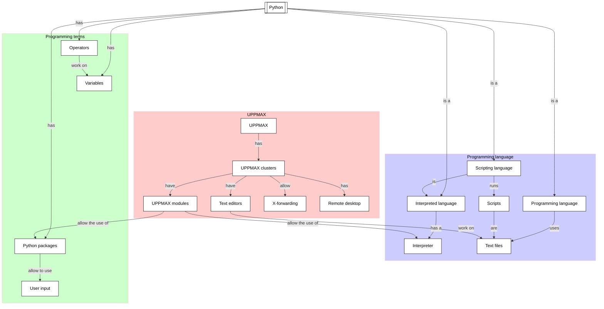

# Variables, expressions and statements: user input

!!!- info "Learning outcomes"

    - Practice using the UPPMAX documentation
    - Practice using the Python book
      [How to Think Like a Computer Scientist: Learning with Python 3](https://openbookproject.net/thinkcs/python/english3e/index.html)
    - Get the type of an object
    - Create a variable
    - Use a variable
    - Practice converting an equation to Python code
    - Find and use the operator for exponentiation
    - Practice the modulo operator
    - Practice converting a simple text question to Python code
    - Learn how to ask a user for input
    - Use input in a calculation

???- question "For teachers"

    Teaching goals are:

    - Learners have worked with variables
    - Learners understand the purpose of variables
    - Learners have obtained the data type of a variable
    - Learners have heard about what a data type is
    - Learners have practiced convert an equation and a text question to Python
    - Learners have read on operators
    - Learners have worked with the modulo operator
    - Learners have written code that asked for user input

    Lesson plan:

    - 5 mins: prior knowledge
    - 5 mins: presentation
    - 15 mins: challenge
    - 5 mins: feedback

    Prior questions:

    - What do we mean with user input?
    - In which ways can we get user input?
    - Why would you want to use user input in your program?


## Overview

In any non-trivial calculation, we want to let our computer remember
things, such as the content of a data file, or the parameters/settings
we use in our program. Variables allows one to make a computer
store ('remember') information. Here we use our first simple variables.

Also we practice converting an equation and a mathematical problem
to Python code. We will discover the helpful modulo operator.




## Exercises

See the exercise procedure [here](../misc/exercise_procedure.md).

### Exercise 1: input

!!!- info "Learning outcomes"

    - learn how to ask a user for input
    - use input in a calculation

Read the following section of
[How to Think Like a Computer Scientist: Learning with Python 3](https://openbookproject.net/thinkcs/python/english3e/index.html):

- `2.10. Input`

Then in section 2.14, do exercise 8.

!!! question "2.14.8"

    Write a Python program to solve the general version of the above problem.
    Ask the user for the time now (in hours),
    and ask for the number of hours to wait.
    Your program should output what the time will be
    on the clock when the alarm goes off.

???- question "Answer"

    Here is a possible implementation:

    ```python
    t_now = int(input("Enter the current hour"))
    n_hours = int(input("Enter the number of hours"))
    t_future = (t_now + n_hours) % 24
    print("Time after that number of hours:")
    print(t_future)
    ```
