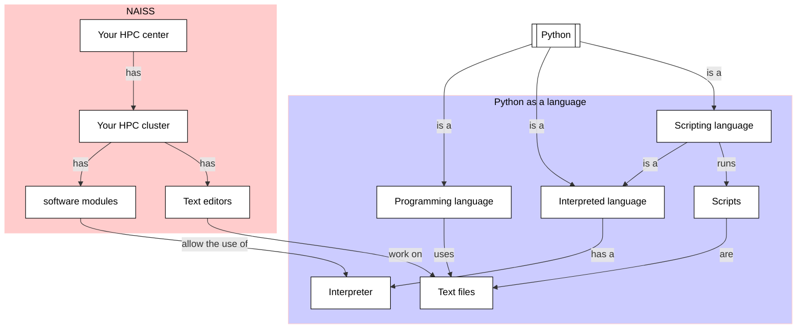

# Working with Python scripts

!!!- info "Learning outcomes"

    - Practice using the documentation of your HPC cluster
    - To be able to create a Python script
    - To be able to run a Python script

???- question "For teachers"

    Teaching goals are:

    - Learners have practiced using the documentation of their HPC cluster
    - Learners have created a Python script
    - Learners have run a Python script

    Other goals are:

    - Verify that learners indeed have learned how to create a file
    - Verify that learners indeed have learned how to use a text editor

    Lesson plan:

    - 5 mins: prior knowledge
    - 5 mins: presentation
    - 15 mins: challenge
    - 5 mins: feedback

    Prior questions:

    - Why would you want to use a script?
    - In which languages can one write a script?
    - How does one run a script?

## Why?

You have multiple lines of code you want a computer to run.
Instead of copy-pasting these lines individually to the
interpreter, one can use a script.

To run code, we use text files that are run as if each line
was typed in into the Python interpreter. Such text files
that run (interpreted) code are called 'scripts'.

In this session, we practice to create and run some simple Python scripts,
now -unlike the previous chapter- without new theory.



## Exercises

This is a partial repeat of the previous session,
however with a different focus.

The goal is to practice the fundamental skills of creating
and running a script.

### Exercise 1: create a Python script

Go to the documentation of the documentation of your HPC cluster,
then answer the questions below. If you cannot find any helpful
information, use
[the UPPMAX documentation about `nano`](https://docs.uppmax.uu.se/software/nano/)

- On your HPC cluster, create a file called `hello_world.py`,
  using a text editor or Linux commands

???- question "Answer"

    Creating a Python script `hello_world.py` using `nano`:

    ```bash
    nano hello_world.py
    ```

- Copy-paste the following content into the script:

```python
print('Hello, world!')
```

???- question "Answer"

    To paste into a terminal, use `CTRL + SHIFT + V` (i.e. add `SHIFT`).

- Save the script

???- question "Answer"

    In [`nano`](https://docs.uppmax.uu.se/software/nano/), you can do
    so with `CTRL + O`

- Close the text editor

???- question "Answer"

    In [`nano`](https://docs.uppmax.uu.se/software/nano/), you can do
    so with `CTRL + X`

- Verify that the script has its contents saved

???- question "Answer"

    One way to do so, is to use `nano` to open the file again:

    ```bash
    nano hello_world.py
    ```

### Exercise 2: run a Python script

Go to the documentation of the documentation of your HPC cluster,
then answer the questions below. If you cannot find any helpful
information, use
[the UPPMAX documentation about how to run a Python script](http://docs.uppmax.uu.se/software/python/#running-python).

- Run the Python script you just created

???- question "Answer"

    You can run this Python script in the shell by:

    ```bash
    python hello_world.py
    ```

