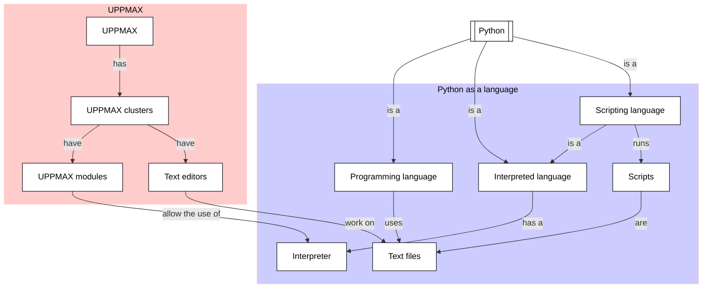

# Working with Python scripts

!!!- info "Learning outcomes"

    - Practice using the UPPMAX documentation
    - To be able to create a Python script
    - To be able to run a Python script

???- question "For teachers"

    Teaching goals are:

    - Learners have practiced using the UPPMAX documentation
    - Learners have created a Python script
    - Learners have run a Python script

    Other goals are:

    - Verify that learners indeed have learned how to create a file
    - Verify that learners indeed have learned how to use a text editor

    Lesson plan:

    - 5 mins: prior knowledge
    - 5 mins: presentation
    - 15 mins: challenge
    - 5 mins: feedback

    Prior questions:

    - Why would you want to use a script?
    - In which languages can one write a script?
    - How does one run a script?

## Why?

You have multiple lines of code you want a computer to run.
Instead of copy-pasting these lines individually to the
interpreter, one can use a script.

To run code, we use text files that are run as if each line
was typed in into the Python interpreter. Such text files
that run (interpreted) code are called 'scripts'.

In this session, we practice to create and run some simple Python scripts,
now -unlike the previous chapter- without new theory.



## Exercises

See the exercise procedure [here](../misc/exercise_procedure.md).

### Exercise 1: create a Python script

Go to the UPPMAX documentation at
[https://docs.uppmax.uu.se](https://docs.uppmax.uu.se),
then answer these questions:

- On Rackham, create a file called `hello_world.py`,
  using a text editor or Linux commands

???- question "Answer"

    Text editors are documented at
    <https://docs.uppmax.uu.se/software/text_editors/>.

    The simplest text editor is called `nano` and is documented at
    <https://docs.uppmax.uu.se/software/nano/>.

    Creating a Python script `hello_world.py` using `nano`:

    ```bash
    nano hello_world.py
    ```

- Copy-paste the following content into the script:

```python
print('Hello, world!')
```

???- question "Answer"

    To paste into a terminal, use `CTRL + SHIFT + V` (i.e. add `SHIFT`).

- Save the script

???- question "Answer"

    In [`nano`](https://docs.uppmax.uu.se/software/nano/), you can do
    so with `CTRL + O`

- Close the text editor

???- question "Answer"

    In [`nano`](https://docs.uppmax.uu.se/software/nano/), you can do
    so with `CTRL + X`

- Verify that the script has its contents saved

???- question "Answer"

    One way to do so, is to use `nano` to open the file again:

    ```bash
    nano hello_world.py
    ```

### Exercise 2: run a Python script

Read the UPPMAX page on running a Python script, [here](http://docs.uppmax.uu.se/software/python/#running-python)

Go to the UPPMAX documentation at
[https://docs.uppmax.uu.se](https://docs.uppmax.uu.se),
then answer these questions:

- Find the UPPMAX page on Python programming

???- question "Answer"

    It can be found at <https://docs.uppmax.uu.se/software/python_programming/>

- Run the Python script you just created

???- question "Answer"

    You can run this Python script in the shell by:

    python hello_world.py
